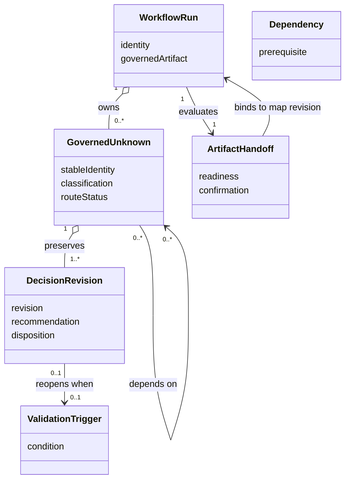
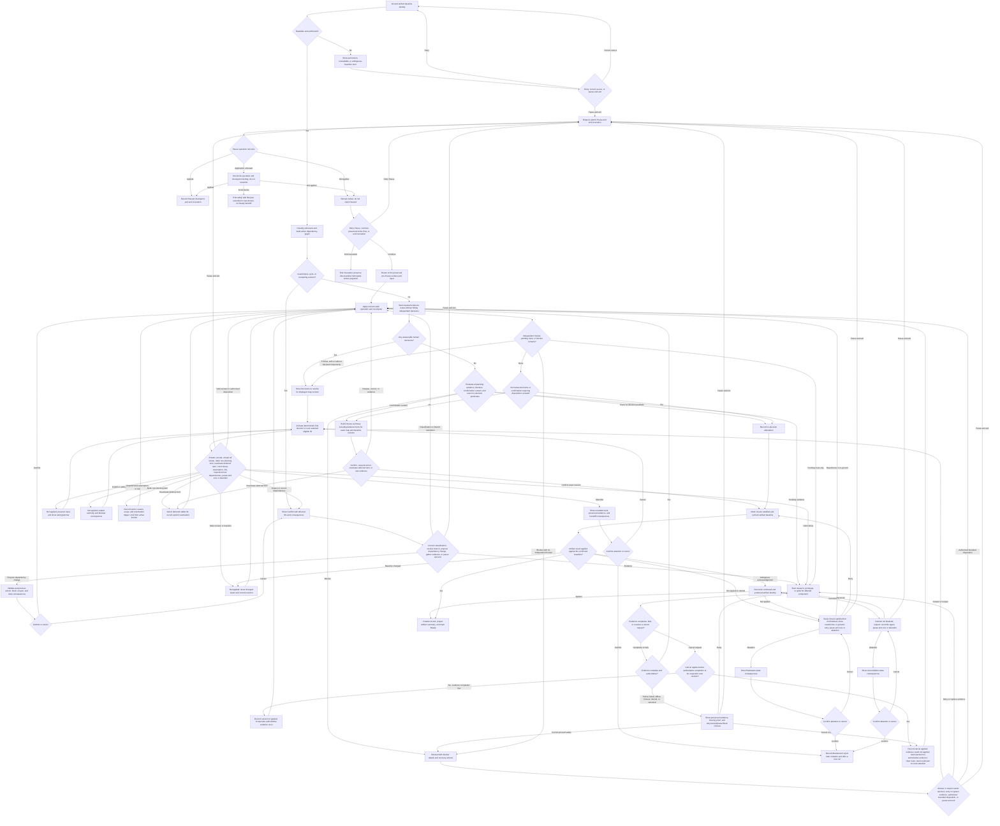
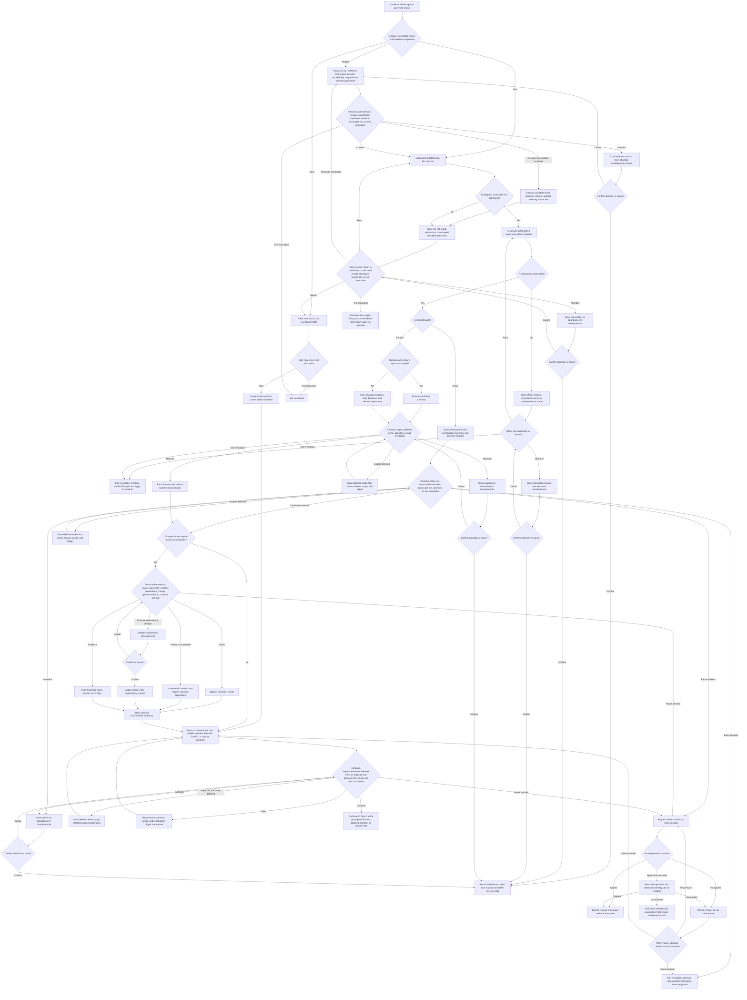
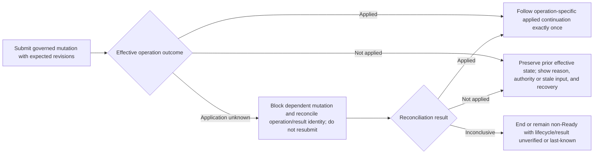

# Decision Interrogation Protocol — Product Specification

## Document control

| Field | Value |
|---|---|
| **Status** | Accepted |
| **Owner** | @timianmalloo |
| **Proposal** | `docs/proposals/grill-me-integration-proposal.html` |
| **Applies to** | `/specify`, `/ui-design`, `/define-architecture`, `/design-slice` |
| **Primary user-facing name** | Decision Interrogation Protocol |
| **Upstream inspiration** | Matt Pocock's `grilling` primitive and `/grill-me` wrapper |
| **Superseded proposal detail** | The proposal's statement that `/design-slice` did not yet exist is obsolete; `/design-slice` is the current canonical command. |

## Executive intent

AI-Forward needs a consistent way to expose and resolve consequential unknowns before they become
silent assumptions, rework, or downstream vetoes. The protocol must preserve the strongest property
of Matt Pocock's approach—a dependency-aware decision frontier—while fitting AI-Forward's evidence,
prototype, spike, artifact, and gate disciplines.

The product experience is deliberately not a separate mandatory `/grill-me` command. Interrogation
is intrinsic where early product or UI direction must be established, and a shared Decision Closure
Gate runs before four artifact handoffs. Well-specified work takes a no-decision fast path.

---

# Part A — Functional specification

## A1. Problem statement

### Problem

Meaningful product, UX, architecture, and component-design work frequently contains unresolved
decisions. Today those decisions may be:

- asked too late, after a draft has hardened into an apparent commitment;
- asked too early, before prerequisite facts or parent decisions are settled;
- asked without a recommendation, transferring avoidable analysis work to the user;
- answered by the agent even though they concern human intent or risk acceptance;
- mixed with factual unknowns the agent should have researched itself;
- hidden in prose, assumptions, risks, or follow-up notes without a uniform handoff rule; or
- left open while the workflow reports an artifact as ready for downstream work.

This produces a recurring failure class: the artifact looks complete while decisions that determine
its scope, acceptance criteria, archetype, contracts, phasing, or risk posture remain unresolved.

### Desired outcome

Each affected workflow must:

1. identify consequential unresolved decisions;
2. model their prerequisite relationships;
3. resolve facts without burdening the user;
4. surface only the human-owned decisions that are currently answerable;
5. give a reasoned recommendation for each surfaced decision;
6. walk the user through those decisions efficiently and sequentially;
7. route uncertainty that cannot be settled conversationally to evidence generation, a bounded
   assumption, authorized residual-risk acceptance, or a blocked handoff;
8. confirm shared understanding before modifying or handing off the governed artifact; and
9. distinguish safe residual unknowns from decisions that must block handoff.

## A2. Evidence and comparables

### Verified source findings

| Source | Finding | Confidence |
|---|---|---|
| [`skills/productivity/grilling/SKILL.md`](https://github.com/mattpocock/skills/blob/main/skills/productivity/grilling/SKILL.md) | The interview is modeled as a design tree. The frontier contains decisions whose prerequisites are settled. Facts belong to the agent; decisions belong to the user. The frontier is recomputed after answers, and action waits for shared-understanding confirmation. | **Verified** — authoritative source read 2026-09-27 |
| [`docs/productivity/grilling.md`](https://github.com/mattpocock/skills/blob/main/docs/productivity/grilling.md) | A frontier is asked in rounds, downstream questions wait for prerequisites, and unresolved experiential questions route to prototypes. The documentation explicitly identifies frontier selection as model judgment rather than a mechanically computed guarantee. | **Verified** — authoritative documentation read 2026-09-27 |
| [`skills/productivity/grill-me/SKILL.md`](https://github.com/mattpocock/skills/blob/main/skills/productivity/grill-me/SKILL.md) | `/grill-me` is only a disabled-model-invocation wrapper that calls the reusable `grilling` primitive. | **Verified** — authoritative source read 2026-09-27 |
| `docs/proposals/grill-me-integration-proposal.html` | AI-Forward's preferred interaction is a frontier summary table followed by one-question-at-a-time dialogue, with an accept-all-shown shortcut and a no-decision fast path. | **Verified** — approved in-repository proposal |
| User request captured by the proposal and audit log | The repository owner explicitly asked to ensure that the right questions are answered early enough and decisions are thought through soon enough, while keeping the interaction seamless and efficient. | **Verified** — direct user evidence |
| `docs/specs/skill-evolution.md` | Cross-skill behavioral changes are contract changes and require regression coverage across the affected skill surfaces. | **Verified** — existing accepted repository specification |
| `docs/specs/design-slice-rename.md` | `/design-slice` is the canonical detailed-design workflow name. | **Verified** — existing accepted repository specification |

### Deliberate adaptation from upstream

The upstream default asks the entire frontier in one round. AI-Forward will instead:

1. show the whole current frontier in one compact table;
2. then ask its questions one at a time;
3. recompute the frontier after each answer; and
4. show newly unlocked questions before continuing.

This preserves dependency awareness and efficient preview while reducing cognitive load and allowing
each answer to alter the next interaction immediately. Users may accept all recommendations on the
**current** frontier, but this never pre-answers decisions that become eligible later.

The first-release user-side success measure is: after the Decision Closure Gate, no required-now
decision represented by the labeled evaluation corpus is first discovered by the next workflow.
Interaction evals also compare the full-table baseline with the delta-first loop and require the
delta-first form to avoid a separate "continue" turn and repeated full-frontier rendering after an
ordinary answer.

## A3. Users and jobs to be done

### Primary persona — repository decision owner

An engineering or product owner directing an AI-Forward workflow who needs to make consequential
choices without being asked to research facts, interpret vague questions, or discover late that a
downstream artifact was built on an unstated premise.

**Job to be done:** When a workflow contains unresolved choices that affect what will be built or
approved, help me understand the live decisions, why they matter, and the recommended path, then let
me settle them with minimal conversational overhead before work proceeds.

### Secondary persona — artifact authoring agent

The agent authoring a specification, UI design, architecture, or design slice.

**Job to be done:** Distinguish evidence work from human judgment, ask only answerable and material
questions, retain the resulting decisions, and know deterministically whether the artifact may be
handed off.

### Tertiary persona — downstream reviewer or implementer

The human or agent consuming the artifact after handoff.

**Job to be done:** See which decisions were settled, which recommendation was accepted or rejected,
which items were bounded as assumptions, which risks were accepted, and what validation triggers
remain.

## A4. Core scenario

During `/specify`, the workflow identifies that the intended users and high-level problem are known,
but the supported audience boundary and the treatment of an uncertain workflow are consequential
human decisions. Factual questions about existing repository behavior are resolved by evidence. The
two independent human decisions appear in a frontier table with their purpose and recommendations.
The user answers the first question. The workflow recomputes the decision map, surfaces a newly
eligible dependent question if one exists, and continues one decision at a time. An experiential
unknown is routed to a comparison prototype rather than debated in prose. When the frontier is empty,
the workflow summarizes all dispositions and requests shared-understanding confirmation. Only after
confirmation does it finalize the specification and mark the handoff ready.

## A5. Scope

### In scope

- A shared Decision Interrogation Protocol used consistently by affected skills.
- Intrinsic early interrogation in:
  - `/specify`, after the initial frame and before evidence scope and acceptance criteria harden;
  - `/ui-design`, after the direction frame and before the design language and mockup harden.
- A Decision Closure Gate before handoff in:
  - `/specify`;
  - `/ui-design`;
  - `/define-architecture`;
  - `/design-slice`.
- Classification of unknowns as facts or human decisions, followed by explicit evidence routes,
  terminal dispositions, and validation triggers.
- A dependency-aware Decision Map and current Decision Frontier.
- A frontier summary table with:
  - question;
  - what the answer is needed for;
  - recommendation.
- One-question-at-a-time interaction after the table.
- Recommendation acceptance, explicit answers, "I don't know", bounded assumptions, and authorized
  risk acceptance.
- Shared-understanding confirmation before artifact update or handoff.
- Plain-text fallback where structured elicitation controls are unavailable.
- Durable recording at the appropriate weight: artifact decision section, decision note, ADR, risk,
  prototype task, or spike task.
- Regression evals for protocol behavior and affected skill contracts.

### Out of scope

- A mandatory standalone `/grill-me` command in the first release.
- Replacing the Rigor Protocol, No-Guessing Protocol, Spike Protocol, UI prototyping workflow, or
  existing adversarial persona gates.
- Asking the user for facts the agent can establish from repository evidence, authoritative sources,
  measurement, or execution.
- Automatically answering human-owned product, UX, architecture, risk, or priority decisions.
- A fixed maximum question count.
- A promise that model-inferred dependency maps are mathematically complete.
- Persisting a global cross-project user profile or personal preference database.
- Implementing a new orchestration service, database, or external dependency.
- Changing the underlying artifact schemas beyond the minimal decision records required by this
  specification.

## A6. Conceptual domain model

### Bounded context

**Workflow Decision Governance** — the context in which a workflow identifies, orders, resolves, and
records decisions that constrain an artifact handoff.

### Ubiquitous language

| Term | Definition | Not this |
|---|---|---|
| **Unknown** | A matter whose answer is not yet established for the current artifact. | Every missing implementation detail. |
| **Fact** | An unknown answerable from evidence, measurement, source, or execution by the agent. | A user preference or risk choice. |
| **Human Decision** | A consequential choice with multiple legitimate answers that belongs to the accountable user. | A fact the user is asked to look up. |
| **Decision Map** | The set of relevant unresolved and resolved decisions plus their prerequisite relationships. | A prewritten questionnaire. |
| **Prerequisite** | A fact or decision whose settlement is required before another decision can be asked honestly. | A merely related topic. |
| **Decision Frontier** | Every unresolved human decision whose prerequisites are settled and which is material now. | All known questions or the whole decision map. |
| **Required-now Decision** | A human decision whose absence prevents a truthful current artifact or safe handoff. | A future optimization choice. |
| **Recommendation** | The agent's proposed answer and concise rationale, based on the available evidence and constraints. | A decision silently made on the user's behalf. |
| **Evidence Route** | A factual investigation, comparison prototype, or contract spike that must return evidence before the governed unknown can settle. | A terminal answer or permission to continue by default. |
| **Bounded Assumption** | A non-blocking belief with an explicit boundary, owner, confirmation route, consequence if false, and validation trigger. | A hidden default or unowned deferral. |
| **Accepted Residual Risk** | A consequential uncertainty consciously accepted by the applicable Risk Authority with rationale, consequence, and review trigger. | An agent-selected shortcut. |
| **Disposition** | The governed unknown's effective outcome for the current handoff: answered, recommendation accepted, researched, deferred from current handoff, bounded assumption, accepted residual risk, excluded, or superseded. A deferred disposition is nonterminal across future handoffs because its trigger or explicit activation reopens it. | A pending evidence route or vague "TBD". |
| **Decision Closure Gate** | The handoff rule that blocks while any required-now human decision remains unresolved or shared understanding is unconfirmed. | A requirement that every conceivable future decision be settled. |
| **Shared Understanding** | Explicit confirmation that the summarized decisions and consequences accurately represent the user's intent. | The agent deciding that the conversation is probably finished. |
| **Decision Map Revision** | The immutable version identifying the exact decisions, dependencies, dispositions, and consequences evaluated for closure. | A display counter or model-memory timestamp. |
| **Mutation Preconditions** | Stable run and operation identity plus the expected artifact, map, and targeted-decision versions required to reject stale or conflicting application. | A conversational reply applied against whichever state happens to be current. |
| **Decision Run Record** | The canonical durable authority for one workflow run's revisions, commands, transitions, and closure evidence. | A rendered table, chat transcript, artifact summary, decision note, or ADR projection. |
| **Run Participant** | A user allowed to inspect a run and pause their current Active interaction. | Authority to accept risk, finalize, supersede, or abandon. |
| **Accountable Owner** | The human accountable for the governed artifact and its workflow-run outcome. | Every participant or the agent authoring the artifact. |
| **Risk Authority** | A human explicitly authorized by project governance to accept the relevant residual-risk class. The Accountable Owner may also hold this role only when governance permits. | The agent, a renderer, or an inferred approver. |

### Entities and value objects

**Entities**

- **Workflow Run** — the aggregate root and consistency boundary for one governed artifact handoff.
- **Governed Unknown** — retains stable identity across classification, evidence routing, decision
  revisions, exclusion, and supersession.
- **Decision Revision** — an immutable, parent-linked revision of a governed unknown's
  classification, question, dependencies, recommendation, evidence basis, answer or disposition,
  and consequence.
- **Artifact Handoff** — the version-bound finalized readiness result for the governed artifact.
- **Command Outcome Observation** — an immutable observation of whether one operation identity and
  semantic request was applied, not applied, or application-unknown.

**Value objects**

- **Question** — concise decision prompt and answer choices where useful.
- **Needed-For** — the artifact consequence the decision controls.
- **Recommendation** — proposed answer plus rationale.
- **Dependency** — prerequisite governed unknown and required revision.
- **Classification** — immutable owner kind: fact or human decision.
- **Route Status** — none, researching, prototyping, spiking, or awaiting answer. Run pause belongs
  only to lifecycle; settlement is represented only by Disposition.
- **Consequence** — what changes or breaks if the item remains unresolved.
- **Disposition** — the governed unknown's effective outcome for the current handoff. Most
  dispositions settle the item for that handoff; `deferred from current handoff` is intentionally
  nonterminal across later handoffs and reopens when its trigger fires or it is explicitly
  reactivated.
- **Validation Trigger** — observable condition that reopens a deferred item or bounded assumption.
- **Confirmation** — explicit shared-understanding result bound to a Decision Map Revision.
- **Run Checkpoint** — workflow-run identity, governed-artifact baseline revision, Decision Map
  Revision, active item, pending evidence routes, blockers, and confirmation revision.
- **Mutation Preconditions** — stable workflow-run and operation identity plus expected artifact,
  Decision Map, and optional targeted-decision revisions.

### Aggregates and invariants

#### Workflow Run aggregate

**Root:** Workflow Run

**Invariants:**

1. The Decision Frontier contains no human decision with an unsettled prerequisite, invalidated
   branch, missing needed-for explanation, or absent recommendation state.
2. The active prerequisite graph is the projection of effective-current revisions and active
   dependency edges. It must be orderable. A cycle or competing successor enters Conflict; closure
   remains blocked, although independent orderable components may continue.
3. Decision changes create immutable successor revisions with traceable ancestry. Each revision
   retains the semantic data required by its disposition: classification, question, needed-for
   consequence, dependencies, recommendation and confidence, answer or evidence, rationale,
   accountable actor, consequence, and any validation or review trigger.
4. Exactly one effective successor may govern an active branch. Competing successors of the same
   predecessor enter Conflict rather than being selected by timestamp or arrival order. Resolving
   the conflict records an immutable resolution fact identifying the selected successor and the
   superseded or rejected candidates; history is never rewritten.
5. Any answer, disposition, evidence return, dependency correction, exclusion, supersession, or
   resume reconciliation that changes closure inputs increments the Decision Map Revision and
   invalidates confirmation bound to an earlier revision.
6. Closure is Satisfied only when every required-now unknown is settled, every remaining unknown has
   an authorized non-blocking disposition, and either:
   - shared understanding confirms the current Decision Map Revision; or
   - the verified no-decision path contains no human decision, bounded assumption, accepted
     residual risk, recommendation divergence, evidence route, conflict, blocker, or other
     confirmation-requiring content, and all facts are established.
   Satisfied closure authorizes a finalization attempt; it is not a Ready handoff.
7. Every mutation carries stable run and command identity plus the expected artifact, Decision Map,
   and targeted-decision versions needed to reject stale application. Its observable effect has one
   authoritative outcome: either the intended semantic transition applies once, it does not apply,
   or its application remains unknown until reconciliation. No Ready handoff may be derived while
   that outcome is unresolved. This requirement does not prescribe a transaction, compare-and-swap,
   journal, or other physical consistency mechanism.
8. Replaying the same command identity with the same semantic payload never creates another
   transition. Reusing the identity for different content enters Conflict and applies nothing.
   Outcome observations are monotonic: `application unknown` may later reconcile to `applied` or
   `not applied`, but a terminal outcome never reverses. While an outcome is unresolved, replay
   reconciles rather than reapplying.
9. Finalization succeeds only when the artifact result is based on the exact confirmed baseline
   identity. A changed baseline or ambiguous application acknowledgement produces no success-shaped
   handoff. Reconciliation uses the operation and produced-artifact identity to determine whether
   the change occurred before retrying; the physical write and coordination mechanism is downstream.
10. The Decision Run Record is the canonical durable authority. Artifact decision sections,
    decision notes, ADRs, audit entries, and UI renderings are revision-bound projections carrying
    workflow-run ID and Decision Map Revision; they never become competing sources of run state.
11. Exclusion and supersession preserve historical edges but deactivate them in the active graph.
    Reopening a prerequisite reopens every effective dependent whose disposition relied on its
    superseded revision.
12. A run has a conceptual lifecycle of Active, Paused, Finalized, and Abandoned.
    Each lifecycle transition has an authorized actor, a stated precondition, and a user-visible
    effect. The transition relation is closed: Pause is `Active -> Paused`; Resume is
    `Paused -> Active`; Finalize is `Active with Closure Satisfied -> Finalized`; and Abandon is
    `Active|Paused -> Abandoned`. Finalized and Abandoned reject lifecycle mutation. New
    substantive work or post-finalization assumption expiry creates or links a successor run.
    Paused runs remain resumable while their record representation is supported. Before representation
    support changes, they must be migrated losslessly; if migration cannot be completed, they remain
    Paused and become visibly unsupported and Blocked with their checkpoint and recovery information
    intact. Compatibility handling does not create another lifecycle state and never makes a run
    unreadable silently.
    Finalized runs retain immutable historical closure and replay evidence for the produced artifact
    revision. Abandonment invalidates any pending closure eligibility.
13. A bounded assumption has an explicit validation condition and expiry trigger. When either fires:
    - in an Active or Paused run, the assumption no longer satisfies closure and the affected branch
      becomes Active or Blocked;
    - after Closure Satisfied but before finalization, closure is invalidated and finalization is
      rejected;
    - concurrently with finalization, the exact-revision precondition permits only one effective
      result: either finalization completes against the still-valid assumption or expiry wins and no
      Ready handoff is produced; and
    - after finalization, historical finalization remains immutable and exactly one effective linked
      successor run becomes Active or Blocked for the still-current governed artifact.
    Replayed or concurrent expiry handling cannot create multiple effective successors for the same
    artifact baseline. Historical readiness remains true as-of its finalized revision; current
    readiness is derived from finalization, expiry, artifact currency, and any effective successor.

The Workflow Run aggregate protects one internal invariant: for one run revision, its decision
lineage, effective branches, command outcomes, lifecycle facts, and closure evidence produce one
deterministic current projection. It references the governed artifact and successor runs by identity;
the artifact's substantive content remains owned by its originating workflow. Finalization and
post-finalization expiry are cross-context process guarantees, not claims that all participating
records share one transaction.

Storage technology, serialization, consistency mechanism, authorization enforcement, indexes, and
migration choreography remain architecture/design decisions, but they must preserve these observable
invariants. First-release records follow the repository's existing audit/history retention: this
protocol adds no independent archive or destructive-delete operation. Active and Paused records
remain available while they are actionable or resumable. Finalized and Abandoned canonical records
remain authoritative while any governed artifact, projection, successor run, or audit reference
depends on them. Repository retention may archive such records only losslessly, preserving decision
meaning, closure evidence, command replay evidence, lineage, and projection-invalidating facts.
Removing a governed artifact must not cascade-delete its decision history or permit a missing
artifact to appear Ready.

### Conceptual relationships



## A7. Decision classification rules

An unknown first receives an owner classification, then a route status, and only later a terminal
disposition. These are separate fields.

| Field | Value | Owner | Required behavior |
|---|---|---|---|
| Classification | **Fact** | Agent | Establish from repository evidence, authoritative sources, measurement, or execution. Do not ask the user. |
| Classification | **Human decision** | User | Surface only when eligible for the current frontier. |
| Route status | **Researching** | Workflow | Establish factual evidence and return it to the same governed unknown. |
| Route status | **Prototyping** | Workflow + user | Compare experiential alternatives; return the result before settlement unless a bounded assumption permits pause. |
| Route status | **Spiking** | Workflow | Establish an unfamiliar or load-bearing contract; return the result before settlement unless a bounded assumption permits pause. |
| Disposition | **Answered / recommendation accepted / researched** | User or agent according to classification | Preserve the answer, evidence, confidence, actor, and revision. |
| Disposition | **Deferred from current handoff** | Accountable owner | Allowed only for an explicitly non-blocking item. Preserve the reason, owner, scope, and reactivation/validation trigger; remove it from the active frontier for this handoff without erasing it. Reopen it when its trigger fires or the user activates it explicitly. |
| Disposition | **Bounded assumption** | Workflow + accountable owner | Reuse the No-Guessing Protocol shape: belief, boundary, owner, confirmation route, consequence if false, and validation trigger. Block if the boundary is unsafe for the current handoff. |
| Disposition | **Accepted residual risk** | Risk Authority | Record recommendation, rationale, consequence, authorization, and review trigger. |
| Disposition | **Excluded / superseded** | Workflow + accountable owner | Preserve history and explain why the item no longer constrains the current branch. |

The record must represent the payload required by each disposition; a disposition label without its
required evidence, rationale, actor, consequence, and trigger is invalid and cannot satisfy closure.

## A8. Question eligibility rules

A question may enter the current frontier only when all are true:

1. its answer materially affects current scope, acceptance criteria, UX archetype, architecture,
   contracts, phasing, migration, test oracle, simplification boundary, or risk posture;
2. it has more than one legitimate answer;
3. evidence alone cannot settle it;
4. every prerequisite is settled;
5. the answer is needed now, or surfacing it now is cheaper and safer than deferral; and
6. the question identifies what its answer is needed for and includes a recommendation.

Eligible frontier decisions use one portable deterministic default order: handoff-blocking
`required-now` decisions first, then all other eligible decisions, with stable decision ID as the
tie-breaker within each group. Renderers and resumed runs must produce the same order for the same
Decision Map Revision. The user may activate any other eligible stable ID without changing that
default order.

A question must not be asked when:

- it requests a fact the workflow can establish;
- it is downstream of an unresolved prerequisite;
- it concerns a cheap, reversible choice that does not change the current artifact or handoff;
- it merely asks the user to approve wording without exposing a decision;
- it is already settled by an authoritative upstream artifact and no conflict exists; or
- it is only relevant to a future slice and is safely bounded by the current artifact.

## A9. Workflow contract

### Derived interaction phases

These phases are projections of the Decision Run Record, not an additional stored state machine.
`Paused`, `Finalized`, and `Abandoned` belong only to the run lifecycle; `Conflict`, `Blocked`,
frontier, and closure eligibility are derived from current decision and outcome facts.

| State | Meaning | Permitted transition |
|---|---|---|
| **Grounding** | Factual evidence and upstream constraints are being established. | Classifying |
| **Classifying** | Remaining unknowns are assigned an owner and route. | Presenting frontier, evidence generation, fast path |
| **Presenting frontier** | The current eligible decisions are summarized. | Asking, accept-all-shown |
| **Asking** | One current decision is active. | Recompute, evidence route, bounded assumption, risk acceptance, paused |
| **Recomputing** | Dependencies and eligibility are reevaluated after a disposition. | Presenting frontier, closure summary |
| **Evidence route** | A prototype, spike, or factual investigation is required. | Recompute when evidence returns; Paused if external work is needed |
| **Conflict** | Dependencies, revisions, or authoritative inputs disagree. | Asking, Evidence route, Recomputing, Blocked |
| **Closure summary** | Settled decisions, bounded assumptions, accepted risks, and consequences are summarized. | Awaiting confirmation |
| **Awaiting confirmation** | Shared understanding is requested for the current Decision Map Revision. | Closure satisfied, Asking, Conflict |
| **Blocked** | A required-now decision or unresolved contradiction prevents handoff. | Presenting frontier, evidence route |
| **Closure satisfied** | Confirmation or no-decision attestation authorizes finalization, but no Ready handoff exists yet. | Finalization, Asking, Conflict |
| **Finalization / reconciliation** | Closure is satisfied and the workflow is applying or reconciling the artifact result. | Ready artifact handoff, closure remains satisfied, Asking, Conflict |

`Finalized` is solely a run-lifecycle fact. A successful finalization implies a Ready handoff for the
produced artifact revision as-of that finalization. The current-readiness projection may later become
false because the artifact is superseded, an assumption expires, or a successor run governs the
current artifact; this does not rewrite the historical Finalized fact.

### Workflow-specific insertion points

| Workflow | Intrinsic early interrogation | Decision Closure Gate |
|---|---|---|
| `/specify` | After the initial problem frame and unknown inventory, before evidence scope, acceptance criteria, UX structure, and UI archetype harden. | After draft and adversarial review, before accepting the specification or handing off to architecture/design. |
| `/ui-design` | After the direction frame and triggered-standard map, before the design language and mockup harden. | After critique and mockup review, before approving the design language/mockup or handing off to detailed design/implementation. |
| `/define-architecture` | No additional mandatory early interrogation beyond its existing evidence and council discipline. | After architecture drafting and council review, before the architecture/ADR handoff. |
| `/design-slice` | No additional mandatory early interrogation beyond its existing contract, model, failure, threat, and test analysis. | After design drafting and adversarial review, before implementation handoff. |

## A10. Functional requirements and acceptance criteria

### Story DI-1 — Resolve facts without asking the user

**As a** decision owner  
**I want** the workflow to establish factual unknowns itself  
**So that** my attention is reserved for choices only I can make.

```gherkin
Scenario: All unknowns are factual
  Given an affected workflow has identified unresolved matters
  And every matter can be established from repository evidence, an authoritative source, measurement, or execution
  When the Decision Interrogation Protocol classifies the matters
  Then no human question is presented
  And the evidence and confidence labels are recorded
  And the workflow takes the no-decision fast path
```

```gherkin
Scenario: Fact lookup is still running
  Given one factual prerequisite is being investigated
  And another human decision is independent of that prerequisite
  When the current frontier is computed
  Then the independent human decision remains eligible
  And only decisions downstream of the unresolved fact are withheld
```

### Story DI-2 — Present only the current decision frontier

**As a** decision owner  
**I want** to see the decisions that can honestly be answered now  
**So that** I am not asked premature or contradictory questions.

```gherkin
Scenario: Two independent decisions are eligible
  Given two unresolved human decisions are material to the current artifact
  And neither depends on the other
  And all their prerequisites are settled
  When the frontier is presented
  Then both decisions appear in the frontier table
  And each row includes the question, what it is needed for, and the recommendation
  And a deterministic default ordering is shown
  And the workflow activates the first decision in that ordering unless the user selects another eligible decision by stable ID
```

```gherkin
Scenario: A dependent decision is hidden
  Given decision B depends on decision A
  And decision A is unresolved
  When the frontier is presented
  Then decision A may appear if otherwise eligible
  And decision B does not appear
```

```gherkin
Scenario: A dependency cycle exists
  Given the Decision Map contains a cycle among unresolved decisions
  When the frontier is computed
  Then the workflow reports a Decision Map conflict
  And does not treat an empty frontier as closure
  And the handoff remains blocked until invalid dependency edges are corrected or the affected items are explicitly excluded or safely dispositioned
```

### Story DI-3 — Give actionable recommendations

**As a** decision owner  
**I want** each question to include the agent's recommendation and rationale  
**So that** I can decide quickly without redoing the analysis.

```gherkin
Scenario: A question is presented
  Given a human decision is in the current frontier
  When its question becomes active
  Then the question states the decision to make
  And it explains what the answer is needed for
  And it presents a recommended answer
  And it gives a concise rationale grounded in current evidence and constraints
  And it allows the user to choose another answer
```

```gherkin
Scenario: The workflow has insufficient evidence for a recommendation
  Given a human decision is otherwise eligible
  But the workflow cannot justify a recommendation from established evidence or explicit constraints
  When it evaluates the decision
  Then it records a Flagged recommendation state
  And identifies the evidence needed to improve it
  And does not present unsupported certainty
  And excludes the item from bulk frontier acceptance
```

### Story DI-4 — Recompute after every answer

**As a** decision owner  
**I want** each answer to reshape what is asked next  
**So that** the dialogue follows the actual decision dependencies.

```gherkin
Scenario: An answer unlocks a downstream decision
  Given decision B depends only on decision A
  And decision A is the active question
  When the user answers decision A
  Then decision A is recorded with its recommendation and answer
  And the frontier is recomputed before another question is asked
  And a delta summary identifies decision B as newly unlocked
  And the full frontier is repeated only on request, material restructuring, or closure review
```

```gherkin
Scenario: An answer invalidates a candidate decision
  Given a candidate decision was relevant under one possible answer
  When the user chooses an answer that removes that branch
  Then the candidate decision is not asked
  And its exclusion is not recorded as an unresolved blocker
```

### Story DI-5 — Support efficient frontier acceptance

**As a** decision owner  
**I want** to accept the current recommendations together  
**So that** low-contention decisions do not require repetitive replies.

```gherkin
Scenario: Accept all current recommendations
  Given the frontier table contains multiple eligible decisions at revision R
  And every displayed recommendation is supported rather than Flagged
  When the user accepts all current recommendations
  Then every decision in that displayed frontier is recorded as recommendation accepted only if the current frontier revision is still R
  And the frontier is recomputed
  And any newly unlocked decisions are presented rather than automatically accepted
```

```gherkin
Scenario: Displayed frontier became stale before bulk acceptance
  Given the user was shown frontier revision R
  And evidence or another disposition changed the current revision
  When the user accepts all recommendations from R
  Then no stale recommendation is applied
  And the current frontier is presented again with the changed items identified
```

```gherkin
Scenario: Individual response was based on stale run state
  Given the user was shown decision Q at Decision Map Revision M and Decision Revision R
  And evidence, a dependency correction, or the governed artifact baseline changed
  When the user submits a response with expected revisions M and R
  Then the response is not applied
  And the workflow identifies which closure input changed
  And the current decision and recommendation evidence are presented again
```

### Story DI-6 — Handle "I don't know" honestly

**As a** decision owner  
**I want** uncertainty to produce evidence or a bounded disposition  
**So that** the workflow does not fabricate certainty or stall without a path.

```gherkin
Scenario Outline: The user does not know
  Given a human decision is active
  When the user answers "I don't know"
  Then the workflow explains why the decision matters
  And routes the unknown to <route>
  And records the consequence and next trigger

  Examples:
    | route |
    | factual research |
    | comparison prototype |
    | contract spike |
    | bounded assumption |
```

```gherkin
Scenario: Required-now decision cannot be deferred safely
  Given a decision controls current scope, safety, acceptance criteria, or a load-bearing contract
  And no safe bounded default exists
  When the user asks to defer it
  Then the workflow explains the consequence
  And the handoff remains blocked
  And the decision remains on the closure summary
```

```gherkin
Scenario: Decision is safe to bound as an assumption
  Given the applicable Test, Security, Data, Privacy, and Distributed Systems gates classify the
    decision as non-blocking for the current artifact
  And a bounded default or exclusion is explicit
  When the accountable owner accepts a bounded assumption
  Then the workflow records the belief, boundary or exclusion, owner, confirmation route, consequence if false, and validation trigger
  And the decision does not block the current handoff
```

```gherkin
Scenario: Risk Authority accepts residual risk
  Given a consequential uncertainty cannot be removed for the current handoff
  And every applicable hard-veto holder has recorded PASS or PASS-WITH-CONDITIONS
  When the applicable Risk Authority accepts the residual risk
  Then the workflow records the recommendation, contrary choice, rationale, consequence, authorization, and review trigger
  And the closure summary identifies the accepted risk distinctly from an assumption
```

### Story DI-7 — Route non-conversational unknowns

**As a** decision owner  
**I want** experiential and contract uncertainty to use the right evidence mechanism  
**So that** prose is not mistaken for proof.

```gherkin
Scenario: Visual direction cannot be settled in prose
  Given a UI direction decision depends on look, feel, pacing, density, or comparative preference
  And the available evidence does not distinguish the options
  When the workflow dispositions the decision
  Then it routes to a focused comparison prototype
  And the prototype question names the options and the decision it will resolve
  And the current artifact records whether work may pause or proceed with a safe boundary
```

```gherkin
Scenario: Contract semantics are unresolved
  Given a decision depends on an unfamiliar, preview, version-sensitive, or load-bearing contract
  When authoritative reading is insufficient
  Then the workflow routes to the Spike Protocol
  And no architecture or design commitment depends on the contract until the spike resolves it
  And if the spike cannot resolve it the run remains Paused or Blocked unless an authorized bounded assumption or accepted residual risk satisfies every applicable gate
```

### Story DI-8 — Close before handoff

**As a** downstream consumer  
**I want** the artifact handoff to represent settled intent  
**So that** I do not implement or review against hidden open decisions.

```gherkin
Scenario: Required-now decision remains unresolved
  Given the workflow is at its Decision Closure Gate
  And at least one required-now human decision is unresolved
  When handoff readiness is evaluated
  Then the handoff is Blocked
  And the workflow lists the blocking decision and its consequence
```

```gherkin
Scenario: Frontier is empty but confirmation is missing
  Given every relevant decision is answered or safely dispositioned
  And shared understanding has not been confirmed
  When handoff readiness is evaluated
  Then the handoff is not Ready
  And the workflow presents the closure summary and requests confirmation
```

```gherkin
Scenario: Shared understanding is confirmed
  Given every required-now decision is resolved
  And every remaining unknown has a permitted non-blocking disposition
  When the user confirms the closure summary for Decision Map Revision R
  Then closure becomes Satisfied for revision R
  And the confirmation is bound to R
  And only then may the workflow attempt to finalize the governed artifact
  But the artifact handoff does not become Ready until finalization succeeds
```

```gherkin
Scenario: Governed artifact changes between confirmation and finalization
  Given shared understanding was confirmed for Decision Map Revision R and artifact baseline B
  And the governed artifact changes to baseline B2 before finalization
  When the workflow attempts to finalize
  Then no artifact update or Ready handoff is committed
  And the run enters reconciliation against B2
  And the prior confirmation is invalidated if the changed input affects closure
```

```gherkin
Scenario Outline: Finalization fault cannot create a false Ready handoff
  Given shared understanding was confirmed for Decision Map Revision R and artifact baseline B
  And finalization reaches <fault point>
  When the outcome is evaluated or retried
  Then the workflow determines whether the artifact result was applied
  And does not apply the artifact mutation twice
  And does not report Ready until the produced artifact and canonical run record agree

  Examples:
    | fault point |
    | before baseline check |
    | after baseline check but before artifact write |
    | after artifact write but before run-record completion |
    | after run-record completion but before acknowledgement |
```

```gherkin
Scenario: Closure inputs change after confirmation
  Given shared understanding was confirmed for Decision Map Revision R
  When an answer, evidence result, dependency correction, exclusion, supersession, or resume reconciliation changes closure inputs
  Then the Decision Map Revision advances
  And the confirmation for R no longer satisfies closure
  And the handoff returns to Asking, Conflict, or Awaiting confirmation as appropriate
```

```gherkin
Scenario: Closure summary is a faithful projection of the confirmed record
  Given the canonical Decision Run Record contains the settled decisions, consequences, recommendation divergences,
    bounded assumptions, accepted residual risks, deferred items, and artifact impact for Decision Map Revision R
  When the workflow builds the shared-understanding summary and its deterministic manifest
  Then every required record field appears exactly once in the manifest under a stable decision ID and field path
  And every human-readable summary statement traces to the same manifest key and preserves its value, polarity,
    accountable actor, scope, confidence, and consequence
  And no unsupported decision, consequence, assumption, risk, divergence, or artifact impact is introduced
  And any injected omission, duplication, unsupported addition, value substitution, polarity reversal,
    wrong attribution, scope change, confidence promotion, or weakened consequence rejects confirmation
```

```gherkin
Scenario: The user corrects the closure summary
  Given the workflow is awaiting shared-understanding confirmation
  When the user identifies a contradiction or incorrect interpretation
  Then the affected decision branch is reopened
  And the handoff returns to Blocked or Asking as appropriate
  And the corrected understanding replaces the incorrect pending summary
```

```gherkin
Scenario: Verified no-decision path requires no ceremonial confirmation
  Given the run contains no human decision, bounded assumption, accepted residual risk, recommendation divergence,
    evidence route, conflict, blocker, or other confirmation-requiring content
  And all facts are established
  When handoff readiness is evaluated
  Then the run records a no-decision attestation for the current Decision Map Revision
  And closure may become Satisfied without a user confirmation step
  But Ready still requires successful finalization
```

### Story DI-9 — Record decisions at the right weight

**As a** future contributor  
**I want** decisions, assumptions, and accepted risks to remain discoverable  
**So that** later work does not reopen settled choices or forget validation triggers.

```gherkin
Scenario: A decision is settled
  Given a human decision has a terminal disposition
  When the governed artifact is finalized
  Then the canonical Decision Run Record retains its question, recommendation, answer or disposition, rationale, consequence, and confidence
  And the governed artifact contains a projection bound to the workflow-run ID and Decision Map Revision
  And a decision note or ADR may document the decision at the appropriate weight without becoming a competing run-state authority
```

```gherkin
Scenario: A bounded assumption is recorded
  Given the handoff may proceed without resolving an unknown
  When the artifact is finalized
  Then the record includes the belief, owner, boundary or safe default, confirmation route, consequence if false, and validation trigger
  And the item remains discoverable to the workflow that will encounter the trigger
```

### Story DI-10 — Preserve a fast path

**As a** user with a well-specified request  
**I want** the workflow to proceed without ceremonial questioning  
**So that** rigor does not become friction.

```gherkin
Scenario: No eligible human decisions exist
  Given factual unknowns are resolved
  And no human decision exists in the run
  And no bounded assumption exists in the run
  And no accepted residual risk exists in the run
  And no recommendation divergence exists in the run
  And no evidence route, conflict, blocker, or other confirmation-requiring content exists
  When the protocol computes the frontier
  Then it presents no question form
  And it records a no-decision attestation for the current Decision Map Revision
  And it proceeds to the next workflow stage without an additional model call solely for interrogation
```

If no decision is currently eligible but any confirmation-requiring content exists, the workflow
must not issue a no-decision attestation. It routes to the applicable evidence, deferred-item review,
closure confirmation, pause, or blocked state.

### Story DI-11 — Work across supported harnesses

**As a** user of any supported AI-Forward harness  
**I want** the protocol to retain its semantics even when interaction controls differ  
**So that** the workflow is portable.

```gherkin
Scenario: Structured elicitation is available
  Given the current harness provides a structured question tool
  When the frontier is presented
  Then the table and active question use the harness-native controls where they preserve the required fields and sequential behavior
```

```gherkin
Scenario: Structured elicitation is unavailable
  Given the current harness does not provide a structured question tool
  When the frontier is presented
  Then a plain-text table is shown
  And questions are asked sequentially with stable, never-reused identifiers and numbered response options
  And all other protocol invariants remain unchanged
```

### Story DI-12 — Detect conflict with an earlier decision

**As a** decision owner  
**I want** contradictions to be reconciled explicitly  
**So that** the latest answer does not silently erase a prior constraint.

```gherkin
Scenario: New answer conflicts with a settled decision
  Given a prior decision is recorded as settled
  And a new answer contradicts it
  When the workflow recomputes the Decision Map
  Then it surfaces the conflict and the affected consequences
  And it asks the user to retain, revise, or supersede the earlier decision
  And the handoff remains blocked until the conflict is resolved
```

```gherkin
Scenario: Superseding a decision reopens affected dependents
  Given decision B and decision C transitively depend on settled decision A
  When the Accountable Owner supersedes A
  Then a new immutable revision of A is recorded
  And B and C are marked unsettled if their prior dispositions depended on the superseded revision
  And the Decision Map Revision advances
  And the frontier is recomputed before closure can be reconsidered
```

```gherkin
Scenario: Replaying a disposition command is idempotent
  Given disposition command K was applied to decision revision R
  When K is replayed with the same semantic request
  Then no duplicate decision revision is created
  And the resulting Decision Map Revision and disposition remain unchanged
  And the current effective command outcome is returned
```

```gherkin
Scenario: Reused command identity has different content
  Given command K was previously applied
  When K is submitted with semantically different content
  Then no mutation is applied
  And the run enters Conflict with both request identities distinguishable
```

```gherkin
Scenario: Application-unknown outcome is reconciled monotonically
  Given command K has an application-unknown outcome observation
  When authoritative reconciliation determines whether the mutation occurred
  Then a new outcome observation records applied or not applied
  And the effective outcome never returns to application unknown
  And replay does not reapply the mutation
```

```gherkin
Scenario: Classification correction preserves history
  Given an unknown was classified as Fact in revision R
  And evidence shows that it is a Human Decision
  When the classification is corrected
  Then a child revision records the corrected classification
  And R remains immutable and superseded
  And affected dependencies and frontier eligibility are recomputed
```

## A11. Non-functional requirements — ISO/IEC 25010

| Attribute | Requirement |
|---|---|
| **Functional suitability** | All canonical protocol semantics and acceptance scenarios above must be represented by executable skill evals or deterministic artifact checks. A release-supported adapter must use automated checks wherever its harness exposes automation. When a host exposes no automatable interaction API, a dated evidence-bearing manual attestation is an allowed proof type only when an independently reviewed capability manifest identifies the unavailable automation surface and records the exact fixture, steps, expected and observed semantic manifest, a deliberately seeded semantic or accessibility mismatch that the procedure rejected, independent reviewer, adapter/version/OS, expiry at the next relevant release, and release-blocking treatment of any mismatch. |
| **Performance efficiency** | With no eligible human decisions, the protocol adds no interrogation-only model call and no user-visible question step. A response produces the next delta, pause/conflict state, or closure summary without a separate "continue" turn. Representative small and large-frontier evals must prove that ordinary answers do not repeat the full frontier. |
| **Compatibility** | The plain-text semantic contract must work in the currently supported Copilot, Claude Code, Codex, Grok, and Agy adapters on Windows and macOS; interaction rendering may adapt to harness capabilities. Each release records the tested adapter/version/OS matrix and visibly marks untested combinations rather than implying support. |
| **Usability** | Before individual questioning, the user can scan the entire current frontier in a table or equivalent labeled list carrying ID, Current/Eligible state, question, needed-for, recommendation, Confidence, and Evidence. Each active question can be answered without quoting it back. "Accept recommendation", "accept all shown recommendations", "I don't know", "request bounded assumption", "accept risk", "inspect/correct dependencies", "inspect evidence", "inspect/reactivate deferred", "retry", and "pause and exit" are explicit options when authorized. |
| **Reliability** | An empty frontier is not sufficient for success when an ordering conflict, unresolved contradiction, running prerequisite, or required current-revision confirmation exists. |
| **AI quality** | Independently labeled evals cover candidate extraction, Fact-versus-Human-Decision classification, required-now/materiality, dependency edges, and evidence-grounded recommendations. Every designated critical omission and every versioned core acceptance case must pass. For the first release, each non-critical category must independently achieve at least 90% observed precision and 90% observed recall, while each critical category must achieve 100% on the versioned corpus. These are empirical release-fixture floors, not statistical guarantees about unseen traffic. Before any scoring run, a versioned evaluation plan fixes the corpus identity and hash, independently labeled expected outcomes, criticality and named material subclasses, prospective sample size of at least 30 normal/boundary/adversarial cases per category, tolerated confidence-interval width, and the 95% Wilson score interval method. Precision uses `TP / (TP + FP)` and recall uses `TP / (TP + FN)`; a zero denominator is a release-blocking invalid evaluation, not a perfect score. A passing point estimate whose interval exceeds the pre-registered width blocks release. Changing the corpus, labels, criticality, threshold, sample size, tolerated width, denominator rule, or interval method after results are known invalidates that run and requires a fresh independently reviewed evaluation; no recorded decision may waive a failed or indeterminate run. Aggregate scores may not hide a failed critical or separately named material subclass. Before scoring, criticality is fixed in the versioned corpus by the persona that owns the affected safety or governance boundary; the Test Architect owns oracle quality and the Product Strategist owns product-materiality labels. Disagreement is adjudicated by those owners and retained rather than silently relabeled. Future plan changes apply prospectively through a recorded decision, previously passing cases remain regression fixtures, and every observed miss becomes a permanent eval case. |
| **Security** | The protocol must not expose secrets or sensitive source content in question summaries, decision records, audit entries, or prototypes. Consequential or irreversible decisions remain subject to existing human and security gates. |
| **Maintainability** | One shared normative protocol defines classification, frontier, interaction, closure, and recording semantics. Affected skills reference it and contain only workflow-specific insertion points and examples. |
| **Portability** | The protocol has a plain-text interaction fallback and does not depend on a specific terminal UI, browser, shell, or operating-system-only feature. |

## A12. AI architecture and capability allocation

### LOA archetype

**H — Long-Horizon Agent**, scoped to a bounded workflow run. The interrogation spans multiple
turns, preserves decisions, recomputes after feedback, and resumes until closure.

### Capability allocation

| Responsibility | Tier | Requirement |
|---|---|---|
| Classify candidate unknowns and formulate questions/recommendations | **T3** | Model-assisted, grounded in artifact and repository evidence; outputs are proposals until validated by deterministic rules or user disposition. |
| Decide whether a matter is factual or human-owned | **T3 + deterministic artifact checks** | Model proposes; versioned records and evals reject missing required fields and fact-shaped questions in fixtures. |
| Validate dependency graph shape and report ordering conflicts | **T0 in the required decision-record evaluator** | Operates on the versioned Decision Run Record, not conversational prose. |
| Compute the current frontier from recorded prerequisites and materiality flags | **T0 in the required decision-record evaluator** | Deterministic for a supplied fixture or run record; candidate completeness remains model-assisted and correctable. |
| Apply disposition transitions and expected-revision checks | **T0 in the required decision-record evaluator** | Closed transition outcomes, stable IDs, and stale-write rejection. |
| Evaluate handoff readiness | **T0 in the required decision-record evaluator** | Version-bound closure invariant and confirmation/no-decision attestation. |
| Summarize decisions and formulate shared-understanding confirmation | **T3** | Model-assisted, checked against the structured Decision Records. |
| Preserve no-decision fast path | **T0 in the required decision-record evaluator** | No interrogation-only model call when the run record contains only established facts and no confirmation-requiring disposition. |

### LOA principles

- **P1 Cheapest Sufficient Tier:** deterministic eligibility and closure rules remain T0.
- **P2 Determinism at the Floor:** the model does not decide handoff readiness.
- **P5 Verification Over Plausibility:** facts route to evidence; experiential uncertainty routes to
  prototypes; contract uncertainty routes to spikes.
- **P7 State Lives at the Edges:** decision state belongs to the Decision Run Record, not assumed
  model memory.
- **P9 Typed Schema Boundaries:** decision records have a defined shape even when rendered as text.
- **P10 Audit Everything:** meaningful workflow runs and load-bearing decisions use the existing audit
  and change-log standards.

### Normative Decision Run Record semantics

Every run emits a machine-readable record, even when the user-facing rendering is plain text. The
physical serialization is a downstream design decision. The record must contain these semantic
groups:

| Group | Required meaning |
|---|---|
| **Identity and compatibility** | Record version, workflow-run identity, governed-artifact identity, and enough compatibility metadata to read supported earlier records or reject an unsupported version visibly. |
| **Artifact baseline and result** | The authoritative input baseline identity, plus the produced-artifact identity and revision after successful finalization. |
| **Lifecycle facts and derived state** | Immutable transition facts and the deterministic current lifecycle/protocol projection derived from them. |
| **Governed unknowns and lineage** | Stable unknown identities; immutable revision ancestry; effective, candidate, superseded, or rejected branch status; classification; dependencies; recommendation; evidence; disposition-specific payload; consequence; and validation/review triggers. |
| **Frontier and blockers** | Inputs needed to deterministically derive the current Decision Map Revision, frontier, active decision, pending evidence routes, conflicts, and blockers. |
| **Confirmation or attestation** | Exact map and artifact baseline confirmed by the user, or a no-decision attestation proving that confirmation-requiring content never existed. |
| **Command outcome observations** | Stable command identity, semantic request identity, expected versions, immutable outcome observations, deterministic effective outcome, and enough durable replay evidence to prevent duplicate mutation. |
| **Lifecycle governance** | Authorized actor and semantic effect for pause, resume, finalization, abandonment, and assumption expiry; projection invalidation; and later-command behavior. |

Missing, ambiguous, or non-monotonic baseline identity enters Conflict rather than selecting the
most recent-looking value. A Finalized record links the input baseline, confirmed Decision Map
Revision, authoritative applied artifact outcome, and produced artifact result.

Records are versioned. During a rollout, required old and new readers/writers must coexist safely:
new readers accept the immediately prior supported representation, incompatible new writes remain
disabled until required readers can consume them, and rollback can read every record written during
the rollout. Unknown incompatible versions fail visibly and never produce a Ready handoff. The
physical migration sequence and rollback mechanism are architecture and release-design concerns;
upgrade, partial-rollout, downgrade, and rollback fixtures must prove these compatibility outcomes.

Regression tests assert canonical semantic manifests and transition outcomes. Renderer parity is
checked against those manifests rather than only comparing renderers with each other. Any intentional
semantic or compatibility change requires a prior recorded decision and a record-version or eval
update.

## A13. Governance lens assessment

| Lens | Applies? | Specification response |
|---|---|---|
| Requirements traceability | Yes | Stories DI-1 through DI-12 map to eval families and affected workflow contracts. |
| Quality attributes | Yes | A11 defines usability, reliability, compatibility, portability, maintainability, security, and performance expectations. |
| Threat model — STRIDE | Yes, lightweight | Primary risks are prompt injection from untrusted proposal/artifact content, disclosure in decision summaries, and confused-deputy continuation past a human gate. Existing Security gates remain authoritative; question content is data, not permission to act. |
| Privacy & data governance | Limited | No new personal-data collection is required. Decision records must avoid PII and secrets and use repository handles where identity is necessary. |
| Accessibility | Yes | Part C requires WCAG 2.2 AA semantics for structured surfaces and an equivalent high-legibility plain-text path. |
| Performance budget | Yes | No-decision runs add no interrogation-only model call; small and large-frontier fixtures prove delta-first updates avoid repeated full-frontier output. |
| Release / rollback / migration | Yes | Skill behavior and the versioned Decision Run Record ship as a pack revision with backward-compatible readers or explicit migration; consumers update through the existing pack protocol. |
| Observability & ops | Yes | Audit entries record the workflow outcome; eval failures identify the violated scenario. No new production telemetry service is required. |
| Supply chain & licensing | Yes | No dependency is added. Upstream concepts are adapted and attributed; implementation must not copy protected prose wholesale. |
| Incident readiness | Yes | Failed closure or contradictory decisions produce explicit Blocked state and a reopen path rather than silent continuation. |

## A14. Regression evaluation families and fixtures

| Eval family | What it proves | Required fixtures |
|---|---|---|
| **Classification and materiality** | Facts are researched; human decisions are asked; required-now/material decisions are distinguished from safely deferred choices; prototypes/spikes use evidence routes; assumptions and risks require their complete records. | only facts; one human decision; required-now decision; safely deferred decision; visual prototype; contract spike; Flagged recommendation |
| **Dependency ordering** | The recorded frontier has no unsettled prerequisite, invalidated branch, fact-classified item, or missing required field; golden maps produce the declared frontier; ordering conflicts never masquerade as closure. | independent decisions; dependency chain; self-loop; multi-node cycle; valid near-cycle DAG; running prerequisite |
| **Frontier presentation** | Table and labeled-list renderings contain the same normalized eligible decisions and required fields. | empty, single, multi-item, and large frontiers; visual narrow/zoomed viewport |
| **Sequential interaction** | One active question follows the table; the user may activate any eligible ID or defer a non-blocking item; every applied answer triggers a delta-first recomputation; independent frontier components remain answerable while another component awaits evidence. | required-now then stable-ID ordering; user-selected eligible ID; deferred non-blocking item with reason/trigger; explicit reactivation; one branch researching; newly unlocked decision |
| **Recommendation integrity** | Every question has a recommendation state, evidence-grounded rationale, and alternatives; Flagged items are excluded from bulk acceptance. | grounded Verified/Inferred recommendation; unsupported Flagged recommendation; contrary user choice |
| **Efficiency** | No-decision runs do not interrogate; bulk acceptance applies only to the displayed revision and never accepts future or stale decisions. The no-decision predicate has one-negative-at-a-time fixtures for every term: human decision, bounded assumption, accepted residual risk, recommendation divergence, evidence route, conflict, blocker, other confirmation-requiring content, and unestablished fact. Each fixture proves that attestation and finalization do not occur and identifies the exact recovery route; deleting any individual guard is observed red. | no unknowns; only facts; matching and stale frontier revision; one failing fixture and guard-removal fault per no-decision predicate term |
| **Closure** | Required-now items, missing current-revision confirmation, running evidence routes, and stale confirmation block; a pure no-decision record may attest without ceremony; the shared-understanding summary is an exactly-once, field-faithful projection of its deterministic manifest. | unresolved blocker; assumption; accepted risk; stale confirmation; no-decision attestation; omitted manifest field; duplicated consequence; invented summary statement; substituted value; reversed polarity; wrong actor; changed scope; promoted confidence; weakened consequence |
| **Evidence routing** | "I don't know" leads to research, prototype, spike, bounded assumption, accepted risk, or Blocked according to authority and safety; route cancellation is revision-safe against concurrent completion. | every route plus unauthorized or unsafe continuation; cancellation-first and completion-first races |
| **Authorization-negative matrix** | Every governed operation and every distinct authority branch has an independent denial fixture proving no mutation, privacy-safe audit evidence, no governed-content disclosure where read access is absent, the exact required authority, and a permitted recovery path. An example row or aggregate family result cannot substitute for an operation/branch fixture. | one fixture per row and conditional authority branch in the conceptual authorization matrix, including inspect/no-disclosure, delegated owners, safety/governance co-approval, risk-class mismatch, veto-holder approval, deterministic-trigger authority, and discretionary successor creation |
| **Conflict and revision lineage** | Contradictions and authoritative-input changes create immutable parent-linked revisions; competing successors conflict; edge deactivation and transitive reopening are deterministic. | supersession chain; concurrent successors; classification correction; reversed branch; excluded prerequisite |
| **Command concurrency and replay** | Every mutation checks map, artifact-baseline, and targeted-decision preconditions as one consistency operation; replay returns the durable prior outcome; command-identity collision conflicts. | stale map; stale decision; stale baseline; same identity/same request; same identity/different request; concurrent bulk and individual response |
| **Finalization and baseline reconciliation** | Satisfied closure cannot become a Ready handoff against a changed or ambiguous baseline; the produced artifact links to the confirmed map and input baseline. | unchanged baseline; changed before confirmation; changed after confirmation; unavailable baseline evidence; not-applied result; ambiguous write result; inconclusive reconciliation |
| **Pause, resume, and lifecycle** | Paused runs stay paused until explicit resume; Pause and exit distinguishes applied, not-applied, and application-unknown outcomes; artifact-based discovery handles zero/one/multiple candidate runs; abandonment and assumption expiry preserve historical authority and exactly one effective current-governance path. | pause applied/not-applied/application-unknown; interrupted unchanged resume; changed resume; run not found; multiple runs; inaccessible checkpoint; abandon preview/cancel/confirm; expiry while Active, Paused, closure-Satisfied, finalizing, and Finalized; replayed/concurrent expiry; successor run |
| **Cross-workflow contract** | The protocol appears at the specified points in all four affected workflows without duplicating divergent semantics. | `/specify`, `/ui-design`, `/define-architecture`, and `/design-slice` contract fixtures |
| **Cross-harness fallback** | Each tested adapter matches a canonical semantic and accessibility manifest for the same fixture; renderer-to-renderer equality alone is insufficient. Automated checks are required where the host exposes automation. Where automation is unavailable, an independently reviewed capability manifest proves that limitation and the evidence-bearing manual procedure demonstrates that a seeded semantic or accessibility mismatch fails before the adapter can be released. | release-recorded harness/version/OS matrix; CI-gated core text renderer; independently reviewed automation-capability manifest; exact-fixture manual attestation with observed manifest, seeded rejected mismatch, independent reviewer, expiry, and blocking mismatch |
| **Accessibility interaction** | Capability-specific focus or reading-order behavior, status announcements, accessible names/states, keyboard operation, non-color semantics, and visual-renderer WCAG checks preserve the full protocol and recovery paths. The proof catalog is a matrix with one row for every portable operation crossed with each applicable hard state and renderer-capability class; non-applicable cells require a reason. Injected omission, focus, announcement, reading-order, and recovery faults must fail in each capability class that exposes the relevant behavior. | operation × applicable-state × renderer-capability matrix covering default; stale response; invalid input; timeout; permission denial; partial evidence; evidence incorporated while Active; evidence received while Paused; inaccessible/corrupt checkpoint; Conflict; Paused; closure satisfied; Finalized |
| **Security scrubbing** | Secrets or sensitive source content do not enter user rendering, decision records, audit entries, or prototype prompts. | planted secret and PII-like fixtures |
| **Prompt/skill/schema regression** | Previously passing workflow evals and the versioned Decision Run Record schema do not regress; a waiver cites a prior ADR/change-log ID. | old/new skill text and schema golden files |
| **Candidate and judgment quality** | Model-assisted extraction, classification, materiality, dependency, and recommendation judgments meet A11's per-category precision, recall, corpus-composition, and uncertainty requirements without aggregate masking. | at least 30 independently labeled normal/boundary/adversarial cases per category; accepted/rejected candidates; fact/decision labels; required-now labels; dependency omissions/cycles; grounded/unsupported recommendations; hidden risk/assumption; critical omissions; failed material subclass |

Every named Gherkin scenario in DI-1 through DI-12, B5, and C5 is a normative oracle. The
implementation test catalog must link each scenario to a fixture that records its initial state,
stimulus, observable result, prohibited result, and red-observed mutation or injected fault.
One fixture may satisfy multiple scenarios only when those links share the same oracle; the catalog
must not substitute an aggregate family label for scenario-level traceability.

### Scenario-to-proof matrix

Concrete fixture filenames and runners are downstream design choices. The implementation proof must
cover at least these independent oracles:

| Requirement / scenario | Initial state | Stimulus | Exact expected outcome | Prohibited outcome | Red-observed fault |
|---|---|---|---|---|---|
| Frontier ordering | DAG with one unsettled prerequisite and one independent eligible decision | Evaluate frontier | Only the independent decision is eligible; dependent decision names its prerequisite | Asking the dependent decision or hiding the independent one | Remove prerequisite filter |
| Bulk acceptance | Displayed frontier revision R with eligible and Flagged recommendations | Accept all shown at R | Only eligible non-Flagged decisions from R are accepted | Accepting a Flagged, stale, or newly unlocked decision | Ignore displayed revision |
| Concurrent mutation | Two operations released through a synchronization barrier against the same expected revision | Execute simultaneously | At most one conflicting successor applies; the other is stale or Conflict | Both successors becoming effective | Ignore expected revision |
| Finalization TOCTOU | Confirmed map R/baseline B; artifact changes or a fault is injected at each DI-8 fault point | Finalize or retry | One authoritative artifact result; Ready only when record and artifact agree | Duplicate application or false Ready | Permit artifact result without exact-baseline validation |
| Deferral and reactivation | Eligible explicitly non-blocking decision with an owner and trigger | Defer, recompute, then trigger or explicitly reactivate | Item leaves the active frontier for the current handoff, remains recorded, and returns only on trigger or explicit activation | Immediate reappearance, silent closure satisfaction, or permanent loss | Ignore deferred disposition |
| Evidence cancellation race | Active evidence route at revision R with concurrent cancellation and authoritative completion | Release both operations together and replay each | Exactly one operation commits against R; cancellation-first preserves non-authoritative partial evidence, completion-first incorporates once and rejects cancellation | Both cancellation and incorporation applying, duplicate incorporation, or lost partial evidence | Ignore expected route revision |
| Pause outcome | Active run with resumable checkpoint material | Inject applied, not-applied, application-unknown, and inconclusive reconciliation outcomes | Paused is claimed only after applied; not-applied remains Active; unknown reconciles without resubmission; inconclusive ends with lifecycle unverified or last-known | Success-shaped Paused state, hidden continuation, duplicate pause, or decision/content mutation before reconciliation | Treat request intent as durable outcome |
| Lifecycle and expiry | Active, Paused, closure-Satisfied, finalizing, or Finalized run with an expiring assumption | Expire, replay expiry, or race expiry with finalization | Closure invalidates before finalization; at most one effective Ready/finalization result; exactly one effective successor for a current artifact after historical finalization | False Ready, duplicate successors, silent erase, implicit resume, or historical rewrite | Ignore expiry revision/precondition |
| Abandonment | Active or Paused run with unsettled work | Request abandon, cancel, then request and confirm | Preview explains consequences; cancel preserves prior state; confirm records Abandoned and rejects later mutation | Immediate abandonment, lost history, or Ready projection | Skip consequence confirmation |
| Record compatibility | Prior and candidate record versions across mixed-version rollout | Upgrade, partial rollout, rollback, and unknown-version read | Prior supported records remain readable; incompatible writes wait; rollback reads rollout records; unknown version fails non-destructively | Lockstep-only migration, unreadable rollback data, or false Ready | Remove prior-reader support |
| Renderer semantics | Canonical manifest with frontier, error, recovery, focus, and announcement expectations | Render through each supported renderer | Each renderer matches the canonical manifest | Two renderers agreeing on the same omission | Remove required semantic field |
| Authorization-negative operation | One fixture for each governed operation and each distinct authority branch | Attempt the operation as a principal missing exactly that authority | `not applied`; all revisions/content unchanged; privacy-safe audit recorded; no governed content disclosed when read access is absent; exact required authority and recovery returned | Any mutation, sensitive disclosure, generic "forbidden" without authority/recovery, or one fixture standing in for another branch | Remove or swap the required role/approval for that operation |
| Closure-summary semantics | Canonical manifest keyed by decision ID and field path | Mutate one rendered statement at a time | Every statement preserves the keyed value, polarity, actor, scope, confidence, and consequence | A traceable but semantically altered statement being confirmable | Substitute value, reverse polarity, change actor/scope, promote confidence, or weaken consequence |
| Accessibility recovery | Active input followed by validation, stale, evidence-close, conflict, pause, and ready transitions | Trigger each transition | Expected focus target, announcement, preserved input, and named recovery action | Lost focus, color-only status, or generic error | Remove focus/announcement mapping |
| Inaccessible checkpoint accessibility | Candidate run whose checkpoint cannot be read or verified | Present recovery in focus-capable and text-only renderers | Focus/reading order names run ID, unverified and last-known lifecycle separately, reason, no mutation, Resume unavailable, and permitted recovery actions | Implicit selection, mutation, hidden lifecycle uncertainty, or focus on unavailable Resume | Reuse ordinary Paused presentation |
| Candidate and judgment quality | Independently labeled normal and adversarial corpus | Extract, classify, prioritize, connect, and recommend | Meets A11 thresholds and every critical judgment case | Passing aggregate accuracy while omitting a critical case or grounding a recommendation in absent evidence | Delete a critical class or evidence source |

---

# Part B — UX specification

## B1. Experience principles

1. **Frontier before focus:** show the user the current decision set before focusing on one question.
2. **One active choice:** only one question requires an answer at a time.
3. **Recommendation, not abdication:** the agent does the analysis and proposes a path.
4. **Evidence, not interrogation theater:** facts are established, not converted into user homework.
5. **Progressive disclosure:** dependent decisions appear only when unlocked.
6. **Honest uncertainty:** "I don't know" produces a route, not shame or fabricated certainty.
7. **Closure is explicit:** the artifact is not accepted merely because the agent ran out of questions.
8. **Fast when obvious:** a well-specified request does not encounter an empty ceremonial gate.

## B2. Information architecture

### Primary information regions

| Region | Purpose | Contents |
|---|---|---|
| **Context line** | Orient the user to the workflow and artifact. | Skill, artifact, Decision Map Revision, count of answerable decisions, dependent decisions waiting, blockers, and paused evidence routes. |
| **Decisions to resolve table/list** | Preview all decisions answerable now. | Stable ID, explicit Current or Eligible state, Question, Needed for, Recommendation, Confidence, and inspectable evidence/source links. |
| **Active question** | Focus the current interaction. | Decision ID/title and revision, concise body, numbered choices where useful, recommendation, confidence, evidence/source links, rationale, and consequence of non-resolution. |
| **Response controls** | Make common dispositions efficient. | Choose answer, accept recommendation, accept all shown recommendations, I don't know, request bounded assumption, accept risk when authorized, inspect/correct dependencies, inspect/reactivate deferred items, pause and exit. |
| **Progress update** | Explain what changed after the answer. | Recorded disposition, newly unlocked/removed questions, remaining blockers. |
| **Evidence route card** | Explain a prototype, spike, or research detour. | Why dialogue is insufficient, evidence to produce, whether handoff is blocked, resumption trigger. |
| **Closure summary** | Confirm shared understanding. | Settled decisions, recommendation divergences, bounded assumptions, accepted risks, blockers, artifact impact, and Decision Map Revision. |
| **Run discovery and resume** | Make interrupted work recoverable from the governed artifact. | Candidate run ID(s), verified or last-known lifecycle, checkpoint accessibility, artifact baseline comparison, deferred-item summary, and permitted resume/restart/abandon/end-invocation actions. |
| **Conflict review** | Resolve competing revisions, invalid dependencies, or command collisions. | Conflicting IDs/revisions, evidence, affected decisions, choose/correct/retry actions. |
| **Handoff status** | State the workflow result plainly. | Closure Satisfied, Ready, Blocked, Conflict, or Paused, with exact reason and revision. |

### Label vocabulary

The UI and artifact must use the ubiquitous-language terms from Part A. In particular, it must not
use "open question" as an undifferentiated bucket when the item is a fact, prototype need, spike need,
bounded assumption, or accepted residual risk.

## B3. User flows

### Flow 1 — Governed interrogation, evidence, closure, and fast path



`F0` is a deterministic state evaluation, not an exclusive-choice prompt. The renderer shows every
applicable pending route, blocker, and confirmation-requiring item together. It keeps any independent
recovery action available, and it routes to closure confirmation or the no-decision attestation only
when that outcome's complete predicate holds.

### Flow 2 — Interruption, resume, and contradiction recovery



### Reusable governed-mutation outcome subflow

Every governed mutation in Flow 1 and Flow 2 uses this subflow rather than treating a request as a
durable result. The submitted operation carries stable operation identity, semantic request identity,
and the expected run, artifact-baseline, map, and targeted-decision or route revisions.



| Governed mutation | Applied continuation | Not-applied / inconclusive recovery |
|---|---|---|
| Answer, recommendation acceptance, bulk acceptance, deferral, reactivation, classification correction, exclusion, supersession, or dependency correction | Recompute through `R` at the committed child revision | Preserve input and prior revision; return to the current decision, Conflict, or refreshed frontier |
| Start or replace an evidence route | Enter `V`/`N` with the committed route identity and keep independent frontier items available | Preserve the prior route state; return to route selection or the originating decision without claiming evidence work started |
| Record or incorporate an evidence completion, failure, timeout, denial, partial result, or cancellation result | Follow `V1`/`V2`/`V4`/`VC` according to the authoritative route outcome, incorporating evidence at most once | Preserve the prior route and Decision Map Revision; return to evidence recovery and reconcile before retrying an ambiguous result |
| Evidence-route cancellation | Follow `VC` when cancellation wins; follow `V4` when authoritative completion already won | Keep the durable route outcome; inspect/reconcile before another cancellation request |
| Create a new Active run | Continue through `C0` into `P` only after the run identity and artifact baseline are durably recorded | Return to new-run choice; do not expose an Active workspace or imply that a run exists |
| Append reconciliation rationale, revise/supersede a decision, or apply a dependency change during Active reconciliation | Follow `K`/`L`/`M2`, show `K1`, then return through `P` | Preserve the pre-reconciliation revision and return to `J` with stale-input, authority, or conflict recovery |
| Apply a deferred-item trigger or bounded-assumption expiry | In Active, commit one child revision and recompute; in Paused, record one pending observation; after Finalized, create or reconcile exactly one successor; in Abandoned, offer evidence only to an authorized new run | Preserve lifecycle and prior revision; reconcile the trigger/expiry identity before retry, and never create duplicate child revisions or successor runs |
| Pause | Follow `P`/`ZP` only after `applied` | Follow `PS2`/`ZPN`; continue Active, retry with a new operation identity only after `not applied`, or end with a discoverable interrupted-Active projection |
| Resume | Follow `O` only after `applied` | Remain Paused; preserve reconciliation summary and offer retry, inspect, abandon, or end invocation |
| Abandon | Follow `AZ`/`A2` only after `applied` | Preserve Active or Paused lifecycle and return to the consequence-confirmation surface |
| Closure confirmation or no-decision attestation | Record closure Satisfied only after `applied` for the exact revision | Return to closure review, stale-input recovery, or authority recovery |
| Finalize | Follow `Q` only after authoritative applied artifact and run-record outcomes agree | Follow `O3`/`O4`; remain non-Ready and reconcile before retry |

## B4. Wireframe-level structure

### Frontier summary

```text
Decisions to resolve · /specify · revision 4 · 2 answerable now · 1 dependent decision waiting

| ID | State | Question | Needed for | Recommendation | Confidence | Evidence |
|----|-------|----------|------------|----------------|------------|----------|
| Q1 | Current | Who is the first supported audience? | Scope and acceptance criteria | Start with repository maintainers | Inferred | Proposal scope and current skill users |
| Q2 | Eligible | Should uncertain visual direction be decided in prose? | UI-design evidence path | No — compare two focused prototypes | Verified | Approved proposal and upstream grilling guidance |

You can answer Q1 now, open Q2, defer a non-blocking item, inspect or reactivate a deferred item,
accept Q1's recommendation, accept all shown eligible recommendations for revision 4, say
"I don't know", request a bounded assumption, or pause and exit.
```

### Active question

```text
Q1 · First supported audience

Which audience must the first release serve?

Needed for
Defines the in-scope workflows, examples, and acceptance criteria.

Recommendation
Start with repository maintainers using AI-Forward interactively.

Why
They are the existing users of all four affected skills, and this avoids introducing a second
automation-only interaction contract before the human-guided path is proven.

If left unresolved
The specification cannot define representative eval cases or a coherent fast path, so handoff stays blocked.
```

### Progress update

```text
Recorded: Q1 — recommendation accepted.
Unlocked: Q3 — whether non-interactive automation may bypass shared-understanding confirmation.
Removed: none.
Remaining: 2 answerable now, 1 dependent decision waiting.
```

### Closure summary

```text
Shared-understanding check

Settled
- Q1: First audience = repository maintainers.
- Q2: Experiential uncertainty routes to comparison prototypes.

Bounded assumptions
- Q4: Batch automation mode — excluded from first release; confirm when a non-interactive consumer is specified.

Accepted residual risk
- Frontier completeness remains model-assisted; regression evals cover known dependency-ordering failures.

Deferred from current handoff
- Q5: Non-interactive batch mode.
  Owner: repository maintainer.
  Reason: no first-release automation consumer exists.
  Scope: current /specify handoff only.
  Reactivation trigger: a non-interactive consumer is specified, or the owner explicitly reactivates Q5.

Handoff impact
- /specify and /ui-design gain early interrogation.
- All four workflows gain the same closure gate.

Confirm this summary, identify the decision to reopen, or reactivate a deferred decision by stable ID.
```

## B5. UX acceptance criteria

```gherkin
Scenario: User can understand the current decision load before answering
  Given one or more human decisions are eligible
  When the frontier is shown
  Then the user can see every currently eligible decision
  And can identify what each decision controls
  And can see the recommendation without opening each question
```

```gherkin
Scenario: User answers without quoting the question
  Given an active question has a stable identifier
  When the user responds with the identifier, a listed choice, or an explicit disposition
  Then the workflow applies the response to the intended decision
  And summarizes the recorded result before moving on
```

```gherkin
Scenario: User selects or defers an eligible decision
  Given multiple independent decisions are eligible
  When the user activates one by stable ID
  Then that decision becomes active without changing the other decisions
  And when the user defers an item classified as non-blocking
  Then the item remains visible as deferred and cannot silently satisfy closure
```

```gherkin
Scenario: Deferred decisions remain inspectable and manually reactivatable
  Given a decision is deferred from the current handoff
  When the frontier, closure summary, or resumed-run view is presented
  Then the deferred section shows its stable ID, reason, owner, scope, and reactivation trigger
  And when the authorized user explicitly reactivates that stable ID in an Active run
  Then the decision returns to the recomputed graph and becomes eligible only when its prerequisites are settled
```

```gherkin
Scenario Outline: Deferred decision reactivation respects lifecycle
  Given a decision is deferred with a recorded validation trigger
  And the run lifecycle is <lifecycle>
  When authoritative evidence establishes that the trigger has fired
  Then the workflow produces <outcome>
  And preserves immutable history
  And invalidates any current Ready projection that the trigger disproves

  Examples:
    | lifecycle | outcome |
    | Active | one child revision in the same run that reopens the decision and affected dependents |
    | Paused | a pending trigger observation that applies only after explicit Resume and reconciliation |
    | Finalized | exactly one effective linked successor run that is Active or Blocked |
    | Abandoned | no mutation; trigger evidence is offered only as input to an explicitly authorized new run |
```

```gherkin
Scenario: Trigger observation races with finalization
  Given finalization and a deferred-item trigger observation both reference Decision Map Revision R
  When both operations are evaluated concurrently
  Then at most one operation may commit against R
  And if the trigger observation commits first, finalization is rejected and closure must be re-established
  And if finalization commits first, the trigger creates or reconciles to exactly one effective successor run
  And retrying either operation cannot duplicate a revision, successor run, or side effect
```

```gherkin
Scenario: Evidence route cancellation preserves useful work
  Given an evidence route has produced partial evidence
  When the user cancels that route
  Then the cancellation operation is recorded as applied
  And the evidence result is recorded as not applied
  And the partial evidence remains recorded as non-authoritative
  And the Route Status is cleared
  And the governed unknown returns to awaiting-answer or route-selection state
  And independent frontier branches are recomputed
  And the handoff remains non-Ready
```

```gherkin
Scenario: Evidence cancellation races safely with completion
  Given a cancellation request and authoritative evidence completion reference the same active route revision
  When both operations are evaluated concurrently
  Then at most one operation commits against that route revision
  And if cancellation commits first, the cancellation is applied and later evidence is retained only as non-authoritative partial evidence
  And if evidence completion commits first, the evidence is incorporated once and cancellation is not applied
  And retrying either operation reconciles to the durable outcome without duplicating a revision or incorporation
```

```gherkin
Scenario Outline: Pause and exit reports its durable outcome
  Given an Active run and an authorized participant requests the atomic Pause and exit operation
  When the operation outcome is <outcome>
  Then the workflow produces <result>
  And never claims the run is Paused unless the durable outcome is applied

  Examples:
    | outcome | result |
    | applied | record Paused with a resumable checkpoint and end the invocation |
    | not applied | remain Active and offer retry or end invocation without claiming Paused |
    | application unknown | block further decision/content mutation, reconcile the operation and checkpoint identity, and report verified or last-known lifecycle |
```

```gherkin
Scenario: No hidden progression after pause and exit
  Given the user pauses and exits the interrogation
  When the current turn ends
  Then the workflow does not finalize or hand off the governed artifact
  And it states the remaining blockers and resume point
```

```gherkin
Scenario: Every flow has a recovery path
  Given the workflow encounters invalid input, contradiction, missing evidence, interruption, or unauthorized continuation
  Then the interaction presents a specific recovery action
  And does not collapse into a generic error or silently continue
```

```gherkin
Scenario: User can inspect dependent decisions without being asked prematurely
  Given one or more decisions are waiting on the active frontier
  When the user requests dependency details
  Then the workflow lists each waiting decision, its prerequisite IDs, and why it is not answerable now
  And does not activate those decisions
```

```gherkin
Scenario: User can resume a paused interrogation
  Given a paused Decision Run Record exists
  When the user invokes an affected workflow against the same governed artifact
  Then the workflow discovers candidate runs from that artifact
  And offers the single accessible run or asks the user to choose among multiple accessible runs
  And summarizes the last disposition, pending evidence routes, blockers, and detected artifact changes before accepting another answer
```

```gherkin
Scenario: Paused work does not resume implicitly
  Given a Decision Run Record is Paused
  When evidence arrives or the workflow is invoked again
  Then no answer, disposition, or handoff is applied
  Until an explicit Resume command passes artifact-baseline reconciliation
```

```gherkin
Scenario: One blocked branch does not hide an independent frontier
  Given one dependency component is waiting on a spike
  And another component contains answerable human decisions
  When the active graph is recomputed
  Then the answerable decisions remain in Decisions to resolve
  And the pending spike is shown separately with its non-Ready consequence
```

```gherkin
Scenario: Dependency correction previews consequences
  Given a user challenges, adds, or removes a dependency
  When the workflow validates the proposed correction
  Then it shows which decisions would unlock, block, reopen, or become stale
  And applies nothing until the revision-safe correction command is confirmed
```

```gherkin
Scenario: Recommendation evidence is inspectable before acceptance
  Given a recommendation is shown
  When the user requests its evidence
  Then the workflow shows the evidence references, confidence label, relevant alternatives, and unresolved gaps
  And returns focus to the same decision and revision without applying a response
```

```gherkin
Scenario: Terminal run rejects lifecycle mutation
  Given a run is Finalized or Abandoned
  When a participant requests Pause, Resume, Finalize, or Abandon on that run
  Then the operation is not applied
  And the canonical record remains unchanged
  And the workflow offers inspect or an authorized successor-run action where applicable
```

```gherkin
Scenario: Expired assumption creates a successor without rewriting history
  Given a Finalized run is affected by an expired assumption
  When expiry is applied to the current governed artifact
  Then the canonical record preserves historical finalization and audit linkage
  And no artifact projection continues to claim a superseded current Ready state
  And the current artifact links to exactly one effective Active or Blocked successor run
```

```gherkin
Scenario: Abandonment requires consequence confirmation
  Given an Active or Paused run has unsettled decisions, evidence work, or closure eligibility
  When the Accountable Owner requests Abandon
  Then the workflow previews the lost continuation, invalidated closure eligibility, preserved history, and new-run consequence
  And offers explicit confirm and cancel actions
  And applies no lifecycle change on cancel
  And applies Abandoned only after explicit confirmation
```

### Lifecycle transition outcomes

Authorization implementation is downstream, but the user-visible outcomes are fixed:

| Operation | Required authority / precondition | Result | Later operations |
|---|---|---|---|
| Pause | Run Participant; source lifecycle is `Active`; no finalization in progress | `Paused`; current answer and evidence work remain checkpointed | Decision/content mutations are rejected until explicit Resume; immutable observations, reconciliation metadata, inspect, and authorized Abandon remain available |
| Resume | Run Participant; source lifecycle is `Paused`; selected run; artifact baseline reconciled | `Active`; changed inputs reopen affected branches before questioning | Mutations use the reconciled current revisions |
| Finalize | Accountable Owner; source lifecycle is `Active`; closure Satisfied; exact confirmation or valid no-decision attestation; unchanged baseline | `Finalized`; produced artifact and closure evidence linked authoritatively; artifact handoff becomes Ready | Replay/inspect allowed; lifecycle mutation rejected; new substantive changes require a successor run |
| Abandon | Accountable Owner; source lifecycle is `Active` or `Paused`; no finalization in progress; consequence preview explicitly confirmed | `Abandoned`; no Ready projection; reason and audit linkage retained | Lifecycle and content mutations rejected; a new run may start from the current artifact |
| Expire assumption | Validation condition or expiry trigger fires while governed artifact is current | Historical Finalized run remains immutable; linked successor run becomes `Active` or `Blocked`; stale Ready projection is invalidated | Revalidation, successor decision, or authorized risk acceptance occurs in the successor run |

### Conceptual authorization matrix

The Decision Run Record names the actor and role used for each governed operation. Credentials,
policy engines, and enforcement mechanisms remain downstream.

| Operation | Required conceptual role |
|---|---|
| Inspect run, evidence, history, or projections | Run Participant with read access |
| Create a new Active run from the current artifact baseline | Run Participant with artifact access |
| Answer or accept a recommendation | Accountable Owner or explicitly delegated decision owner |
| Accept all shown recommendations for an exact displayed revision | Accountable Owner, or every explicitly delegated decision owner for the decisions included in that bulk request |
| Pause or resume an Active/Paused run | Run Participant |
| Defer a non-blocking item | Accountable Owner or the item's explicitly delegated owner |
| Confirm shared understanding | Accountable Owner or explicitly delegated decision owners for every included decision |
| Issue a no-decision attestation | Deterministic protocol evaluator after the canonical no-decision predicate passes |
| Manually reactivate a deferred item | Accountable Owner or the item's explicitly delegated owner, while the run is `Active` |
| Correct Fact-versus-Human-Decision classification | Accountable Owner after deterministic validation and consequence preview |
| Apply a dependency correction | Accountable Owner after deterministic validation and consequence preview |
| Start or replace an evidence route | Run Participant with artifact access; any external side effect also requires its own tool/boundary authority |
| Record an evidence-result observation | Deterministic protocol evaluator after source and route-identity verification |
| Incorporate authoritative evidence into the Decision Map | Deterministic protocol evaluator after exact route/map revision validation |
| Cancel an evidence route | Run Participant who started the route, Accountable Owner, or explicitly delegated evidence owner |
| Append a retain-with-evidence reconciliation rationale | Accountable Owner or explicitly delegated decision owner |
| Apply a verified deferred-item trigger or bounded-assumption expiry | Deterministic protocol evaluator after exact trigger and current-governance validation |
| Create or reconcile a successor run | Deterministic protocol evaluator after a valid trigger; Accountable Owner authorization when starting a discretionary new run |
| Accept a bounded assumption | Accountable Owner plus every safety/governance authority required by the affected boundary |
| Accept residual risk | Risk Authority for that risk class |
| Exclude, supersede, or resolve competing decision revisions | Accountable Owner, with any mandatory veto-holder approval |
| Finalize the governed artifact | Accountable Owner after closure and gate requirements are satisfied |
| Abandon the run | Accountable Owner after explicit consequence confirmation |

Automatic deterministic evaluator actions are limited to derived-state computation, validation,
idempotent reconciliation, no-decision attestation under the exact canonical predicate, and
successor-run reconciliation when the governing trigger has already authorized that transition.
The evaluator may not make a human decision, accept residual risk, widen scope, alter dependencies
without confirmation, or resolve an authority conflict.

This table is the canonical authority contract. No acceptance scenario, renderer, adapter, or test
may strengthen, weaken, or rename an authority requirement. Where a row permits alternatives or
requires a composite authority, authorization proof contains one independent denial fixture per
branch: each alternative role is tested absent while all other preconditions hold, and each member
of a composite authority is removed one at a time. The operation remains `not applied` in every
denial fixture.

```gherkin
Scenario Outline: Unauthorized governed operation is rejected without mutation
  Given operation <operation> requires authority <authority>
  And the acting principal does not hold that authority
  When the operation is attempted
  Then the operation outcome is not applied
  And the run revision, Decision Map Revision, governed-artifact baseline, and artifact content remain unchanged
  And the attempted operation and acting principal are retained as audit evidence without sensitive data
  And the response identifies <authority> and the permitted recovery path

  Examples:
    | operation | authority |
    | pause | Run Participant |
    | resume | Run Participant |
    | new Active run creation | Run Participant with artifact access |
    | answer | Accountable Owner or delegated decision owner |
    | recommendation acceptance | Accountable Owner or delegated decision owner |
    | bulk recommendation acceptance with one included decision authority absent | Accountable Owner or delegated owners for every included decision |
    | bounded-assumption acceptance | Accountable Owner plus every required safety/governance authority |
    | residual-risk acceptance by a non-matching risk approver | applicable Risk Authority for the named risk class |
    | deferral | Accountable Owner or delegated item owner |
    | closure confirmation with one required decision authority absent | Accountable Owner or delegated owners for every included decision |
    | no-decision attestation issuance | deterministic evaluator with every predicate term verified |
    | manual reactivation | Accountable Owner or delegated item owner in an Active run |
    | classification correction | Accountable Owner after validated preview |
    | dependency correction | Accountable Owner after validated preview |
    | evidence-route start or replacement | Run Participant with artifact access plus any required tool/boundary authority |
    | evidence-result observation recording | deterministic evaluator after source and route-identity verification |
    | authoritative evidence incorporation | deterministic evaluator after exact route/map revision validation |
    | evidence-route cancellation | route owner, Accountable Owner, or delegated evidence owner |
    | retain-with-evidence rationale | Accountable Owner or delegated decision owner |
    | trigger or expiry application | deterministic evaluator after exact trigger and current-governance validation |
    | exclusion | Accountable Owner with mandatory veto-holder approval |
    | supersession | Accountable Owner with mandatory veto-holder approval |
    | competing-revision resolution | Accountable Owner with mandatory veto-holder approval |
    | finalization | Accountable Owner |
    | abandonment | Accountable Owner |
    | successor-run creation | valid deterministic trigger plus Accountable Owner when discretionary |
```

```gherkin
Scenario: Unauthorized inspection discloses no governed run content
  Given a principal lacks Run Participant read access to a candidate run
  When the principal attempts to inspect its evidence, history, projection, or checkpoint
  Then the operation outcome is not applied
  And no decision content, evidence content, artifact content, secret, or sensitive metadata is disclosed
  And the run revision, Decision Map Revision, governed-artifact baseline, and artifact content remain unchanged
  And privacy-safe audit evidence records the denied operation and acting principal
  And the response identifies the required read authority and a non-disclosing recovery path
```

---

# Part C — UI specification

## C1. Medium and platform posture

### Primary medium

Conversational terminal/chat interaction across supported coding-agent harnesses.

### Authoritative interaction guidance

- The host harness's accessible question or elicitation control is preferred when it can preserve the
  required table fields, sequential active question, and disposition options.
- GitHub-flavored Markdown and plain text are the portable baseline.
- The interaction must remain fully usable by keyboard and screen reader.
- The workflow must not rely on color, pointer-only controls, animation, or browser rendering.

## C2. Selected UI archetype

### Primary archetype

**A3 · Branching Diagnostic Wizard**

### JTBD-to-archetype rationale

The dominant job is a dependency-driven guided interrogation in which each answer changes which
decision can be asked next. This is a branching state machine, not a freeform chat, dashboard, or
static form.

### Archetype Signature

```text
DecisionInterrogation {
  Type:Diagnostic;
  Arch:Branching;
  Layout:FormWizard;
  Nav:Breadcrumb;
  Viewport:FluidResponsive;
  Input:KeyboardFirst;
  Feedback:Confirmed+StrictValidation;
  Motion:None;
  Pacing:UserDriven;
  Transition:HardCut;
  A11y:WCAG_2.2_AA+HighLegibility+ScreenReaderFirst;
}
```

### Recorded deviations from canonical A3

| Facet | Canonical A3 | This protocol | Rationale |
|---|---|---|---|
| Navigation | `Stepper+Breadcrumb` | `Breadcrumb` | Textual context and state labels replace a visual stepper in terminal/chat. |
| Motion | `Micro` | `None` | The portable baseline is terminal/chat; state changes are expressed in text and native control updates. |
| Transition | `Morph` | `HardCut` | Immediate recomputation and text updates are clearer and more portable than animated transitions. |
| Input | `KeyboardFirst+TouchPrimary` | `KeyboardFirst` | The cross-harness baseline is keyboard-driven; touch remains available through host-native controls where present. |
| Accessibility | `WCAG_2.2_AA` | `WCAG_2.2_AA+HighLegibility+ScreenReaderFirst` | Tabular summaries and changing question state require explicit high-legibility and announcement behavior. |

Persistence and synchronization facets are intentionally omitted: continuity is required, but the
store and synchronization mechanism are architecture/design decisions.

## C3. Surface inventory and complete states

| Surface | Default | Loading | Empty | Disabled / unavailable | Error | Success | Overflow / degraded |
|---|---|---|---|---|---|---|---|
| **Decision workspace** | Current frontier plus one active decision, stable IDs, explicit Current/Eligible state, purpose, recommendation, Confidence, Evidence, choices, and consequence. | Factual/evidence progress is shown without hiding independent answerable decisions. | No question controls; use no-decision attestation only when no blocker or pending route exists. | Authority- or capability-dependent actions remain named and expose why they are unavailable plus the route to gain authority or choose a supported alternative. | Invalid, ambiguous, stale, denied, duplicate, timeout, or failed response preserves input and states whether it applied. | Recorded disposition and recomputed frontier. | Labeled lists replace tables before horizontal scrolling; grouping/pagination reconciles exactly with counts. |
| **Evidence and recovery** | Evidence references, alternatives, unresolved gaps, route, blockers, and available recovery. | Progress with cancel and pause-and-exit where supported, without losing decision context. | "No evidence recorded" blocks a Verified claim. | Unsupported evidence routes remain listed with the reason and an available research, prototype, spike, or pause alternative. | Offline, denied, stale, partial, failed, canceled, or ambiguous outcomes identify retry/reconcile/cancel/pause-and-exit and remain non-Ready where required. | Evidence incorporated; revision advances; independent frontier recomputes. | Long evidence is grouped and navigable by source ID. |
| **Run recovery** | Candidate runs, verified lifecycle, last-known lifecycle when verification fails, baseline status, pending routes, deferred items, and blockers. | Discovering or reconciling runs. | Offer a new run without implying prior state. | Inaccessible runs or unauthorized lifecycle actions remain named with reason and recovery; no unavailable run is selected implicitly. | An inaccessible or corrupt checkpoint reports lifecycle as unverified or last-known and permits no mutation; failed re-grounding of an accessible Paused run offers retry, abandon, or end invocation while remaining Paused. | Explicit Resume enters Active only after successful read-only reconciliation. | Multiple candidates require explicit selection; none is chosen by recency alone. |
| **Conflict resolution** | Competing revisions or proposed dependency correction with evidence and consequence preview. | Validating a proposed resolution. | N/A when no conflict exists. | Resolution actions outside the actor's authority remain visible with the required owner or veto-holder named. | Stale/colliding operation is not applied and identifies recovery. | Confirmed resolution records immutable lineage and recomputes. | History and inactive edges remain inspectable. |
| **Closure and handoff** | Settled decisions, deferred items, bounded assumptions, accepted risks, artifact impact, lifecycle/status, exact revision, and confirmation action. | Re-evaluating closure or reconciling finalization. | Concise no-decision attestation, not an empty report. | Confirmation, risk acceptance, finalization, or abandonment remains named but unavailable when authority/preconditions are absent, with the missing condition and recovery route stated. | Contradiction, changed baseline, not-applied mutation, or inconclusive reconciliation blocks success and offers re-ground/retry/reconcile/pause-and-exit/abandon. | Closure Satisfied authorizes finalization; Ready identifies the successfully finalized artifact and next workflow. | Long summaries group by decision area and retain stable IDs; textual state labels remain authoritative. |

## C4. Interaction and copy requirements

### Required semantic fields and example copy

| Purpose | Required fields; example copy |
|---|---|
| Frontier heading | `Decisions to resolve · <skill> · revision <n> · <count> answerable now · <count> dependent decisions waiting` |
| Needed-for label | `Needed for` |
| Recommendation label | `Recommendation` |
| Recommendation rationale | `Why` |
| Unsafe continuation | `This decision cannot continue on an assumption or accepted risk because <consequence>. The handoff remains blocked.` |
| Bounded assumption | `Assumption bounded until <trigger>. Current boundary: <default or exclusion>. Consequence if false: <consequence>.` |
| Evidence route | `Talking cannot settle this honestly. <Prototype/Spike/Research> is needed to decide <decision>.` |
| Evidence detail | `Evidence for <decision> · Confidence: <label> · Sources: <references> · Gaps: <unresolved>` |
| Shared understanding | `Confirm this summary, or identify the decision to reopen.` |
| Fast path | `No human-owned decisions are required for this artifact. Continuing with the established evidence and constraints.` |

### Portable semantic operations

Plain text is the mandatory portable fallback. Native controls are progressive enhancement. Every
renderer must expose semantically equivalent operations for:

```text
choose an answer
activate another eligible decision by stable ID
defer a decision only when it is explicitly classified non-blocking
inspect deferred decisions with stable ID, owner, reason, scope, and reactivation trigger
reactivate a deferred decision by stable ID
accept this recommendation
accept all shown recommendations for the displayed revision
state "I don't know" and select/generate an evidence route
request a bounded assumption
accept residual risk when authorized
inspect evidence
cancel an evidence route without discarding partial evidence
propose a dependency correction and review its consequences
reopen or correct a decision
retry or reconcile a failed operation, even when no decision is active
confirm the exact closure revision
resume an explicitly selected paused run
pause and exit while preserving the checkpoint
abandon a run only after a consequence preview and explicit confirm/cancel choice
```

The plain-text renderer uses stable IDs, explicit Current/Eligible state, numbered choices, explicit
expected revision(s), and named action families so every operation is unambiguous. Decision
activation, answer selection, and recommendation acceptance must use disjoint, self-describing
forms equivalent to `open Q2`, `answer Q1 option 2`, and `accept Q1`; a bare number is prohibited
where it could identify either a decision or an answer choice. Exact tokens and syntax within those
semantic constraints are a renderer-design decision.
Every response reports `applied`, `not applied`, or `application unknown` before another question or
operation is activated.

The fields are normative; the example wording is not. Copy must be concise, specific, and non-accusatory. The interface must not describe users as failing
to answer, and it must not imply that accepting the recommendation is the default required behavior.

## C5. Accessibility requirements

```gherkin
Scenario: Frontier table has an accessible equivalent
  Given the current harness cannot expose a Markdown table accessibly
  When the frontier is presented
  Then the same information is rendered as a numbered list
  And each item preserves ID, Current or Eligible state, Question, Needed for, Recommendation, Confidence, and Evidence
```

```gherkin
Scenario: Portable commands cannot confuse decision activation with answer selection
  Given the renderer accepts plain-text operations
  When the user enters a decision activation, answer selection, or recommendation acceptance
  Then the operation uses a disjoint named action and stable decision ID
  And a bare number is rejected as ambiguous whenever it could name either a decision or an answer option
  And the rejection preserves the user's input and shows valid self-describing forms
```

```gherkin
Scenario: Unavailable operations expose reason and recovery
  Given an operation requires authority or a renderer capability the current actor or host does not have
  When that operation is presented
  Then a native control exposes a disabled or unavailable programmatic state and its reason
  And a text-only renderer prints the named action followed by "unavailable because" and the reason
  And both identify the authority, prerequisite, or supported alternative that would make progress possible
```

```gherkin
Scenario: Dynamic question changes are announced
  Given an answer unlocks or removes decisions
  When the host supports live-region or native status announcements
  Then the changed counts and new active question are announced without moving focus unexpectedly
  But when the host lacks that capability
  Then a distinct textual status line states the changed counts, disposition, and new active-question ID before the next prompt
```

```gherkin
Scenario: Evidence completion distinguishes Active incorporation from Paused receipt
  Given authoritative evidence completes for a governed unknown
  When the run is Active
  Then the workflow announces that evidence was incorporated
  And names the prior and current Decision Map Revision, changed decision IDs and counts, frontier delta, and exact new focus destination
  But when the run is Paused
  Then the workflow announces that evidence was received but not incorporated
  And states that the Decision Map Revision is unchanged, the run remains Paused, and Resume is required
  And exposes no decision/content mutation control
  And exposes only Resume and authorized Abandon as lifecycle mutations
  And may also expose inspect, retry-access, and end-invocation as non-mutating operations
```

```gherkin
Scenario: Errors announce application status and preserve recovery context
  Given a response is invalid, ambiguous, stale, denied, timed out, offline, partially completed, or has an ambiguous commit result
  When the error is presented
  Then the message names the affected decision ID and revision
  And states "not applied" or "application unknown"
  And preserves the submitted input
  And names the exact retry, refresh, inspect, resume, pause-and-exit, or end-invocation action
```

```gherkin
Scenario: Inaccessible checkpoint has an accessible recovery oracle
  Given a candidate run's checkpoint is unavailable or corrupt
  When its recovery state is presented
  Then the checkpoint-unavailable heading receives focus in a focus-capable renderer
  And the reading order states the run ID, current lifecycle as unverified, separately labeled last-known lifecycle when available, reason, no-mutation result, and Resume unavailable
  And retry-access, conflict-safe restart, authorized accessible abandon, and end-invocation actions follow in that order when permitted
  And the renderer does not select or mutate the inaccessible run
```

```gherkin
Scenario: Protocol transitions preserve attention by renderer capability
  Given the renderer supports programmatic focus
  When validation, stale replacement, evidence close, reopening, or status change occurs
  Then focus moves to the destination defined by the focus transition matrix
  And a deterministic return path restores the unchanged active interaction where applicable
  But given the renderer is text-only
  When the same transition occurs
  Then the status or error appears immediately before the unchanged or replacement prompt in reading order
  And no claim of programmatic focus is made
```

```gherkin
Scenario: Structured controls expose equivalent semantics
  Given the host supplies native question controls
  When a frontier or active question is rendered
  Then every control exposes a programmatic name, role, Current or Eligible state, stable decision ID, numbered option label, validation error association, availability state and reason, and applied/not-applied result
  And focus-capable hosts follow the focus transition matrix
```

```gherkin
Scenario: Visual renderer reflows at narrow width and zoom
  Given the host is a visual browser-based renderer
  Given the rendered width is 320 CSS pixels or browser zoom is 400 percent
  When the frontier is presented
  Then the frontier uses the labeled-list form
  And no required information needs horizontal scrolling
```

```gherkin
Scenario: Keyboard-only completion
  Given the user uses only a keyboard
  When they perform every portable semantic operation supported by their authority
  Then every action is operable without a pointer
  And hard states including invalid, stale, denied, application-unknown, Conflict, Blocked, Paused, closure Satisfied, and Ready remain recoverable
```

```gherkin
Scenario: Meaning is not color-dependent
  Given the host renders Ready, Blocked, Paused, Conflict, or Flagged with color
  Then each state also has a textual label
```

```gherkin
Scenario: Accessibility behavior conforms to the canonical manifest
  Given a canonical fixture is rendered through a supported native control and through plain text
  When tested against the renderer's declared capabilities
  Then both expose every field in the authoritative renderer-independent accessibility manifest
  And focus-capable renderers expose programmatic names, roles, states, error associations, announcements, focus destinations, and return paths
  And text-only renderers mark unavailable programmatic APIs as not applicable
  And text-only renderers provide equivalent labeled status, error, and recovery text at the required reading-order positions
  And the normalized Decision Run Record and transition trace are equal
```

### Status announcement matrix

| Transition | Required announcement content |
|---|---|
| Answer applied | Decision ID, `applied`, recorded disposition, changed frontier counts, next active decision ID or closure status |
| Invalid/ambiguous input | Decision ID, `not applied`, concise reason, preserved input, valid recovery actions |
| Stale revision | Decision ID, `not applied`, which expected revision changed, replacement revision, refresh/review action |
| Application unknown | Operation and decision/run ID, `application unknown`, no duplicate-submit instruction, reconcile/inspect action |
| Run discovery/reconciliation | Run IDs or count, discovery/reconciliation status, selected run if any, blockers, and next action |
| Candidate run selected | Selected run ID, verified or last-known lifecycle, map revision, checkpoint/baseline status, deferred-item count, and permitted Resume/restart/abandon/end-invocation actions |
| Inaccessible or corrupt checkpoint | Run ID, `current lifecycle unverified`, separately labeled last-known lifecycle when available, inaccessible/corrupt reason, `no mutation applied`, Resume unavailable, and permitted retry-access/conflict-safe-restart/accessible-abandon/end-invocation actions |
| Deferred decision inspected/reactivated | Decision ID, owner, reason, scope, trigger, prior/current disposition, affected frontier delta, and next action |
| Dependency validation | Decision/edge IDs, valid/invalid status, affected frontier delta, and inspect/correct action |
| Closure re-evaluation | Prior and current closure status, changed decision IDs, and confirmation requirement |
| Closure confirmation | Exact map and artifact baseline revision, confirmed/attested result, Closure Satisfied status, and finalization/reopen action |
| Finalization | Closure revision, artifact baseline result, applied/not-applied/application-unknown status, and retry/reconcile/pause-and-exit action |
| Evidence route started/progressed/failed/canceled | Decision ID, route kind, status, partial-evidence disposition, whether independent decisions remain answerable, and next action |
| Evidence received while Paused | Decision ID, route kind, `received; not incorporated`, partial-evidence disposition, unchanged Decision Map Revision, `Paused`, and `Resume required` |
| Evidence incorporated while Active or after Resume | Decision ID, route kind, incorporated evidence disposition, prior/current Decision Map Revision, changed decision IDs and frontier counts, and resulting active-decision ID or closure status |
| Conflict | Conflicting stable IDs/revisions, `not applied`, consequence, inspect/resolve/pause-and-exit actions |
| Paused | Run ID, `Paused`, checkpoint summary, blockers, explicit Resume requirement |
| Abandon preview | Run ID, unsettled decisions/evidence, consequences, and explicit confirm/cancel choices |
| Abandon canceled | Run ID, `not applied`, unchanged lifecycle, and return destination |
| Abandon confirmed | Run ID, `Abandoned`, preserved-history statement, later-mutation rejection, and new-run option |
| Closure satisfied / Ready | Run ID, exact confirmed or attested revision, finalization status, produced artifact identity when Ready, next action or workflow |

### Focus and reading-order transition matrix

| Transition | Focus-capable renderer | Text-only renderer |
|---|---|---|
| Initial frontier | Focus the frontier heading and retain focus there; the complete summary and active-question heading follow in canonical reading order, and the user navigates to the active question | Frontier heading, complete summary, then active prompt |
| Validation failure | Focus the associated error summary, with a deterministic return action to the unchanged input | Error immediately before unchanged prompt |
| Answer applied | Announce the status without moving focus when the current control remains; otherwise focus the new active-question heading, or the closure heading when no question remains | Delta status immediately before new prompt or closure summary |
| Frontier replaced as stale | Focus the replacement active-question heading; if none exists, focus the replacement-status heading | Replacement status immediately before replacement prompt |
| Application outcome unknown | Focus the reconciliation-status heading; no answer control receives focus | Application-unknown status immediately before reconcile/inspect instructions |
| Run discovery/reconciliation | Focus the discovery/reconciliation heading; candidate selection follows in programmatic reading order | Discovery/reconciliation summary before candidate list and selection instructions |
| Evidence route starts or progresses | Retain focus on the current active interaction when it remains valid; otherwise focus the evidence-status heading | Evidence status before the unchanged active prompt or route controls |
| Evidence received while Paused | Retain the existing focused element when it remains present; otherwise focus the Paused-status heading. Decision/content mutations are unavailable; Resume and authorized Abandon are the only lifecycle mutations | `Received; not incorporated; run remains Paused; Resume required` immediately before Resume, authorized Abandon, and non-mutating inspect/retry-access/end-invocation options |
| Evidence incorporated while Active or after Resume | Focus the recomputed active-question heading, or the closure heading when no active question remains | Evidence disposition and revision delta immediately before the recomputed prompt or closure summary |
| Evidence route fails or is canceled | Focus the evidence-outcome heading; route-selection or originating-decision controls follow | Failure/cancellation status before route selection or originating prompt |
| Evidence detail closes | Focus the originating decision heading at the same revision | Return marker immediately before originating prompt |
| Deferred decision inspected | Focus the deferred-item heading; reactivate/return controls follow | Deferred-item details before reactivate/return instructions |
| Deferred decision reactivated | Focus the reactivated decision heading when eligible; otherwise focus its waiting-reason heading | Reactivation status before the new prompt or waiting-state explanation |
| Dependency preview opens/closes | On open, focus the preview heading; on close, focus the originating correction control without applying | Preview then explicit return marker before originating prompt |
| Dependency validation completes | Focus the corrected active-question heading when one exists; otherwise focus the validation-outcome heading | Validation outcome before corrected frontier or correction instructions |
| Conflict or blocker | Focus the conflict/blocker heading; available recovery operations follow | Conflict/blocker status before recovery options |
| Candidate run selected | Focus the selected-run summary; permitted Resume, inspect-deferred, abandon, or end-invocation controls follow | Selected-run summary before permitted Resume, inspect-deferred, abandon, or end-invocation options |
| Inaccessible or corrupt checkpoint | Focus the checkpoint-unavailable heading; Resume is absent, and permitted recovery controls follow | Unverified lifecycle, separately labeled last-known lifecycle, reason, no-mutation result, then retry/restart/accessible-abandon/end-invocation options |
| Pause | Paused-status heading | Paused status before resume or end-invocation options |
| Resume | Reconciliation summary, then first active decision or closure heading | Reconciliation summary before first prompt or closure heading |
| Abandon preview opens | Consequence-preview heading and confirm/cancel controls | Consequence preview immediately before confirm/cancel prompt |
| Abandon canceled | Prior active decision, reconciliation, or paused-run heading | Cancellation status immediately before the prior prompt/options |
| Abandon confirmed | Abandoned-status heading and new-run action | Abandoned status immediately before the new-run option |
| Closure re-evaluation | Closure-delta heading, then reopened decision or confirmation controls | Closure-delta status before reopened prompt or confirmation instructions |
| Closure confirmation | Closure-status heading followed by finalization or reopen controls | Closure status immediately before finalization/reopen options |
| Finalization applied/not applied/unknown | Finalization-status heading followed by handoff, retry, or reconciliation controls | Finalization status before handoff, retry, or reconciliation instructions |
| Closure satisfied / Ready | Closure or handoff heading | Closure or handoff heading before next actions |

The canonical accessibility manifest has two layers. Its authoritative renderer-independent layer
contains, for each portable operation and hard state: stable run/decision/operation IDs; expected and
current revisions; labels, questions, descriptions, and numbered choices; Current/Eligible,
lifecycle, route, disposition, conflict, blocked, closure, and Ready states; confidence and evidence
references; consequences; availability state and reason; applied/not-applied/application-unknown
outcome; preserved input; recovery actions; artifact-baseline and checkpoint verification state;
partial-evidence disposition; and required reading-order outcome. No renderer may omit one of these
fields when it is applicable. Its capability-specific layer declares programmatic
names, roles, states, error associations, announcements, focus destinations, and return paths when
the renderer supports them; unavailable APIs are explicitly not applicable and require equivalent
labeled text at the renderer-independent reading-order position. For visual renderers, normal text meets WCAG 2.2 AA contrast, focus indicators and control boundaries
meet the applicable 3:1 non-text contrast requirement, visible focus is never obscured, and pointer
targets meet 24 by 24 CSS pixels minimum or satisfy WCAG 2.2 SC 2.5.8 spacing: for each undersized
target, a 24-CSS-pixel-diameter circle centered on its bounding box does not intersect another target
or the corresponding circle for another undersized target. The only exceptions are: the target is
inline in a sentence or otherwise constrained by the line-height of non-target text; an equivalent
control on the same page meets the target-size requirement; the size is determined by the user agent
and is not modified by the author; or that particular presentation is essential or legally required.
The core plain-text renderer
proves the no-color, keyboard-first fallback; host-native renderers prove their visual contrast,
focus visibility, target size, reflow, and zoom obligations against the canonical semantic manifest.

## C6. AI interaction and trust requirements

### Applicable HAX guidelines

- **G1 Make clear what the system can do:** explain that the protocol identifies and recommends
  decisions; it does not replace the accountable decision owner.
- **G2 Make clear how well it can do it:** state that dependency/frontier inference is model-assisted
  and may be corrected.
- **G7 Support efficient invocation:** offer accept-recommendation and accept-all-shown.
- **G8 Support efficient dismissal:** allow a user to pause and exit or mark a question irrelevant, with
  consequence checking.
- **G9 Support efficient correction:** allow reopening and superseding a prior decision.
- **G10 Scope services when in doubt:** route to prototype, spike, bounded assumption, or blocked
  handoff rather than invent certainty.
- **G11 Make clear why the system did what it did:** every question states what it is needed for and
  why the recommendation is preferred.
- **G12 Remember recent interactions:** retain the active run's decision history across turns.
- **G15 Encourage granular feedback:** users can reject or revise individual recommendations.
- **G16 Convey consequences of actions:** assumptions, acceptance, and risk choices state artifact and
  handoff consequences.
- **G17 Provide global controls:** pause-and-exit/review and accept-all-shown are always available when
  decisions are active.

Bulk acceptance must summarize the exact displayed revision and affected decisions before applying
it. Flagged recommendations, accepted-risk choices, and decisions with consequential alternatives
are never silently included.

### Shape-of-AI patterns

- **Wayfinder:** the frontier table shows where the decision process is and what can be answered now.
- **Tuner:** explicit choices, recommendation acceptance, bounded assumptions, and "I don't know" shape the path.
- **Governor:** shared-understanding confirmation occurs before artifact update or handoff.
- **Trust builder:** evidence labels, recommendation rationale, consequences, and residual risks are
  visible.

### Wrong-answer path

The user must be able to:

- reject a recommendation without penalty;
- correct a misclassified fact or human decision;
- reopen a settled branch;
- point out a missing dependency;
- reject the closure summary; and
- require additional evidence.

These actions must preserve prior records and show what downstream decisions are affected.

## C7. Performance budget

- **No-decision path:** no interrogation-only model call and no additional user interaction step.
- **Question transition:** after a response is accepted, the next frontier or closure summary appears
  in the next normal assistant turn without a separate "continue" round trip.
- **Rendering:** visual browser renderers switch the frontier table/list to a labeled list before
  horizontal scrolling is required at 320 CSS pixels and 400% zoom; text-only renderers preserve
  the same information in reading order.
- **Evidence routes:** timeout, failure, cancellation, and cancellation/completion races produce
  explicit route and operation outcomes; canceled work remains non-Ready, and an ambiguous commit
  result is never success-shaped.
- **Context:** the active interaction includes the current frontier and compact decision history, not
  the full transcript of every prior wording; authoritative records remain in the Decision Run
  Record and its revision-bound artifact projections.

## C8. Design-language posture

A product-wide `DESIGN.md` is not required for the first protocol release because the primary surface
is host-native conversational/terminal UI and introduces no independent visual brand system. If a
dedicated interactive HTML or native UI is later added, `/ui-design` must produce the design language
and token system before implementation.

---

# Traceability

## Story-to-flow-to-surface map

| Functional story | UX flow | UI surface |
|---|---|---|
| DI-1 Facts without user burden | Flow 1: grounding/evidence branches | Evidence detail, evidence-route status, no-decision note |
| DI-2 Current frontier | Flow 1: frontier branch | Decisions to resolve |
| DI-3 Recommendations | Flow 1: active decision | Active question and controls |
| DI-4 Recompute | Flow 1: recompute loop; Flow 2 resume | Progress update |
| DI-5 Accept current frontier | Flow 1: current-revision acceptance | Active question and controls |
| DI-6 I don't know / bounded disposition | Flow 1: evidence/assumption/risk branches | Evidence detail, evidence-route status, handoff status |
| DI-7 Prototype/spike routing | Flow 1: Evidence route | Evidence-route status, Resume selection |
| DI-8 Closure | Flow 1: closure/confirmation/no-decision branches | Closure summary, handoff status |
| DI-9 Durable record | Flow 1 finalization; Flow 2 checkpoint/resume | Closure summary, Resume selection, Decision Run Record |
| DI-10 Fast path | Flow 1 no-decision branch | No-decision note |
| DI-11 Harness portability | Flow 1 render alternatives | Native structured control or canonical labeled-list fallback |
| DI-12 Conflict recovery | Flow 1 conflict/dependency branches; Flow 2 reconciliation | Conflict review, progress update, closure summary |

---

# Confidence ledger

| Claim | Evidence | Disconfirming check | Label |
|---|---|---|---|
| Dependency-aware questioning reduces premature downstream questions compared with a prewritten questionnaire. | Upstream `grilling` source and documentation define prerequisite-aware frontiers and recomputation. | Upstream documentation admits frontier selection is model judgment; this spec adds deterministic validation/evals rather than claiming completeness. | **Verified** for the source mechanism; **Inferred** for impact until evals run |
| AI-Forward should show the frontier then ask one question at a time. | Approved proposal explicitly selects table-first plus sequential dialogue; upstream documents sequential preference as a supported user need. | Upstream's default favors whole-frontier rounds for fewer turns. The adaptation preserves frontier preview and adds accept-all-shown for efficiency. | **Verified** decision |
| `/design-slice` is the correct fourth workflow. | Existing `spec-design-slice-rename` and current canonical skill source. | Proposal's older statement was checked and found stale. | **Verified** |
| A3 Branching Diagnostic Wizard is the selected UI archetype. | The job is a dependency-driven question DAG where each answer determines what becomes eligible next. | A1 was considered; it better describes the final closure/reveal but not the dominant branching interaction. | **Verified specification decision** |
| H Long-Horizon Agent is the selected LOA archetype. | The workflow spans multiple turns, maintains decision state, incorporates feedback, and resumes until closure. | A pure Plan/Execute Split does not capture repeated recomputation and conversational state. | **Verified specification decision** |
| No new external dependency or service is required. | The protocol can be expressed through skill instructions, existing artifacts, evals, and host-native interaction controls. | Implementation design has not yet been completed. | **Inferred** |

---

# Flagged risks and residual unknowns

| Risk / unknown | Current disposition | Validation trigger |
|---|---|---|
| Model-assisted candidate-decision and dependency extraction may omit a relevant branch. | Accepted residual risk for the first release; require correction/reopen affordances and regression cases for observed misses. | Any missed decision found in review or downstream implementation becomes a permanent eval fixture. |
| Cross-harness structured question controls differ. | Plain-text semantic baseline is required; harness-native controls are progressive enhancement. | `/design-slice` must inventory supported harness capabilities before implementation. |
| The correct persistence mechanism for interrupted runs may vary by harness. | Requirement is session/artifact continuity, not a specific store. | `/define-architecture` or `/design-slice` establishes the per-harness contract. |
| The table-first/sequential pattern may create too many turns for large independent frontiers. | Delta-first updates, stable-ID selection, defer-non-blocking, accept-current-frontier, and pause-and-exit/review controls mitigate; no fixed question cap. | Eval and user review on representative large independent decision maps. |
| A3 may prove too turn-intensive for very large independent frontiers. | Accepted as the first-release archetype because stable-ID selection and bulk acceptance preserve efficiency; treat a different archetype as a successor specification decision rather than silently changing this one. | Representative large-frontier evals or user evidence showing unacceptable completion cost. |
| Whether a standalone `/grill-me` front door is useful later remains open. | Explicitly out of scope for first release. | Revisit after intrinsic and closure-gate usage data shows a distinct standalone job. |

---

# Adversarial gate record

| Gate | Date | Reviewer | Exit criteria met | Verdict | Vetoes |
|---|---|---|---|---|---|
| Scope and smallest-correct review | 2026-09-27 | The Simplifier | No standalone command or new external dependency is required; persistence and implementation mechanisms remain downstream decisions. | PASS | none |
| Conceptual model and lifecycle review | 2026-09-27 | Data & Persistence Architect | Aggregate authority, revisions, lifecycle transitions, retention, compatibility, concurrency, and successor-run semantics are explicit and falsifiable. | PASS | none |
| UX specification review | 2026-09-27 | UX Researcher / Information Architect | Happy, alternate, interrupted, error, recovery, multi-run, and no-answerable-decision paths are complete and reachable. | PASS | none |
| UI and accessibility review | 2026-09-27 | UX & Accessibility | Renderer-independent semantics, deterministic focus and reading order, paused/inaccessible states, WCAG 2.2 AA, reflow, contrast, and target-size behavior are specified. | PASS | none |
| Verification architecture review | 2026-09-27 | Test Architect | Canonical authority, pre-registered statistical evaluation, per-term no-decision falsification, manual-fallback eligibility, accessibility-manifest cardinality, concurrency, lifecycle, cancellation, compatibility, and summary fidelity each have deterministic proof paths and red controls. | PASS | none |

`GATE specification · 2026-09-27 · Simplifier, Data & Persistence Architect, UX Researcher/IA,
UX & Accessibility, Test Architect · exit criteria met: all layer-specific acceptance claims have
falsifiable proof paths and every hard veto is cleared · verdict: PASS · vetoes: none`

---

# Handoff

With the specification accepted:

1. `/define-architecture` determines the shared protocol's artifact boundaries, cross-harness state
   contract, and deterministic/model-assisted allocation.
2. `/design-slice` specifies the first vertical slice, including affected skill wording, decision
   record shape, fallback interaction, and regression evals.
3. No changes under `pack/` are authorized by this specification alone.
